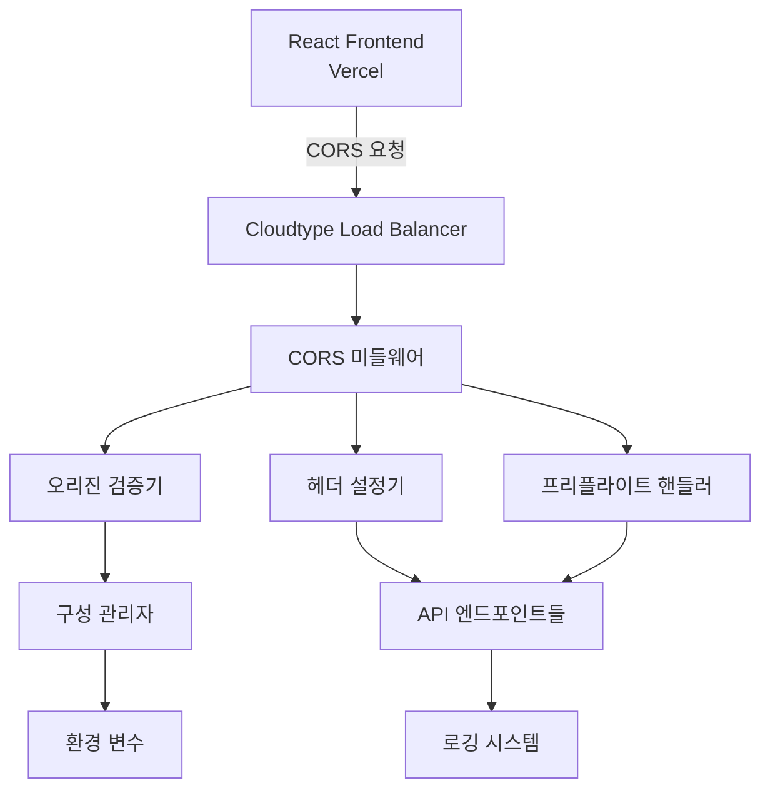

# 설계 문서: CORS 구성 수정

## 개요

이 설계는 Vercel에 호스팅된 React 프론트엔드와 Cloudtype에 호스팅된 Node.js 백엔드 서버 간의 CORS(Cross-Origin Resource Sharing) 문제를 해결합니다. 현재 시스템은 적절한 CORS 헤더가 없어 브라우저가 API 요청을 차단하고 있습니다.

핵심 솔루션은 Express.js 미들웨어를 통해 포괄적인 CORS 처리를 구현하는 것입니다. 이는 오리진 검증, 적절한 헤더 설정, 프리플라이트 요청 처리, 그리고 환경별 구성을 포함합니다.

## 아키텍처

### 고수준 아키텍처



### 미들웨어 스택

CORS 미들웨어는 Express.js 애플리케이션의 초기 단계에 배치되어 모든 들어오는 요청을 가로챕니다:

1. **요청 인터셉션**: 모든 HTTP 요청이 CORS 미들웨어를 통과
2. **오리진 검증**: 요청 오리진이 허용된 도메인 목록과 비교
3. **헤더 설정**: 적절한 CORS 헤더가 응답에 추가
4. **프리플라이트 처리**: OPTIONS 요청이 적절히 처리됨
5. **요청 전달**: 검증된 요청이 실제 API 핸들러로 전달

## 컴포넌트 및 인터페이스

### 1. CORS 미들웨어 (CORSMiddleware)

메인 미들웨어 함수로 모든 CORS 로직을 조정합니다.

```typescript
interface CORSMiddleware {
  // Express 미들웨어 함수
  handle(req: Request, res: Response, next: NextFunction): void;
  
  // 구성 업데이트
  updateConfiguration(config: CORSConfiguration): void;
  
  // 미들웨어 상태 확인
  getStatus(): CORSStatus;
  
  // 레거시 함수 (하위 호환성)
  setCORSHeaders(req: Request, res: Response): void;
}
```

**참고**: `setCORSHeaders` 함수는 하위 호환성을 위해 제공되며, 내부적으로 `setBasicCORSHeaders`를 호출합니다. 기존 코드에서 `setCORSHeaders`를 사용하는 경우 별도 변경 없이 통합된 CORS 구현을 사용할 수 있습니다.

### 2. 오리진 검증기 (OriginValidator)

요청 오리진을 허용된 도메인 목록과 비교하여 검증합니다.

```typescript
interface OriginValidator {
  // 오리진 검증
  validateOrigin(origin: string): ValidationResult;
  
  // 허용된 오리진 목록 업데이트
  updateAllowedOrigins(origins: string[]): void;
  
  // 캐시된 검증 결과 가져오기
  getCachedValidation(origin: string): ValidationResult | null;
}

interface ValidationResult {
  isValid: boolean;
  matchedOrigin?: string;
  reason?: string;
}
```

### 3. 헤더 설정기 (HeaderSetter)

적절한 CORS 헤더를 응답에 설정합니다.

```typescript
interface HeaderSetter {
  // 기본 CORS 헤더 설정
  setBasicHeaders(res: Response, origin: string): void;
  
  // 프리플라이트 헤더 설정
  setPreflightHeaders(res: Response, origin: string): void;
  
  // 자격 증명 헤더 설정
  setCredentialsHeaders(res: Response): void;
}
```

### 4. 프리플라이트 핸들러 (PreflightHandler)

OPTIONS 요청을 처리하고 적절한 프리플라이트 응답을 제공합니다.

```typescript
interface PreflightHandler {
  // OPTIONS 요청 처리
  handlePreflight(req: Request, res: Response): void;
  
  // 요청된 메서드 검증
  validateRequestedMethod(method: string): boolean;
  
  // 요청된 헤더 검증
  validateRequestedHeaders(headers: string[]): boolean;
}
```

### 5. 구성 관리자 (ConfigurationManager)

환경 변수에서 CORS 설정을 로드하고 관리합니다.

```typescript
interface ConfigurationManager {
  // 구성 로드
  loadConfiguration(): CORSConfiguration;
  
  // 구성 검증
  validateConfiguration(config: CORSConfiguration): ValidationError[];
  
  // 런타임 구성 업데이트
  updateConfiguration(config: Partial<CORSConfiguration>): void;
}

interface CORSConfiguration {
  allowedOrigins: string[];
  allowedMethods: string[];
  allowedHeaders: string[];
  allowCredentials: boolean;
  maxAge: number;
  developmentMode: boolean;
}
```

## 데이터 모델

### CORS 구성 모델

```typescript
interface CORSConfig {
  // 허용된 오리진 목록
  allowedOrigins: string[];
  
  // 허용된 HTTP 메서드
  allowedMethods: HTTPMethod[];
  
  // 허용된 헤더
  allowedHeaders: string[];
  
  // 자격 증명 허용 여부
  allowCredentials: boolean;
  
  // 프리플라이트 캐시 시간 (초)
  maxAge: number;
  
  // 개발 모드 여부
  developmentMode: boolean;
}

enum HTTPMethod {
  GET = 'GET',
  POST = 'POST',
  PUT = 'PUT',
  DELETE = 'DELETE',
  OPTIONS = 'OPTIONS',
  PATCH = 'PATCH'
}
```

### 요청 컨텍스트 모델

```typescript
interface RequestContext {
  // 요청 오리진
  origin: string;
  
  // 요청 메서드
  method: HTTPMethod;
  
  // 요청 헤더
  headers: Record<string, string>;
  
  // 프리플라이트 요청 여부
  isPreflight: boolean;
  
  // 타임스탬프
  timestamp: Date;
}
```

### 검증 결과 모델

```typescript
interface ValidationResult {
  // 검증 성공 여부
  isValid: boolean;
  
  // 매칭된 오리진 (성공 시)
  matchedOrigin?: string;
  
  // 실패 이유 (실패 시)
  failureReason?: string;
  
  // 검증 시간
  validatedAt: Date;
}
```

## 정확성 속성

*속성은 시스템의 모든 유효한 실행에서 참이어야 하는 특성 또는 동작입니다. 본질적으로 시스템이 수행해야 하는 작업에 대한 공식적인 명세입니다. 속성은 사람이 읽을 수 있는 명세와 기계가 검증할 수 있는 정확성 보장 사이의 다리 역할을 합니다.*

### 속성 1: CORS 헤더 포함

*모든* API 요청에 대해, 응답은 필수 CORS 헤더(Access-Control-Allow-Origin, Access-Control-Allow-Methods, Access-Control-Allow-Headers)를 포함해야 합니다
**검증: 요구사항 1.1, 1.4, 1.5**

### 속성 2: 프리플라이트 응답 완전성

*모든* OPTIONS 프리플라이트 요청에 대해, 응답은 적절한 CORS 헤더와 Access-Control-Max-Age 헤더(86400초)를 포함해야 합니다
**검증: 요구사항 1.2, 6.1**

### 속성 3: 자격 증명 헤더 설정

*모든* 자격 증명이 포함된 요청에 대해, 응답은 Access-Control-Allow-Credentials 헤더를 true로 설정해야 합니다
**검증: 요구사항 1.3**

### 속성 4: 오리진 검증 정확성

*모든* 요청에 대해, 허용된 오리진에서 온 요청은 성공해야 하고, 허용되지 않은 오리진에서 온 요청은 403 상태 코드로 거부되어야 합니다
**검증: 요구사항 2.1, 2.2**

### 속성 5: 대소문자 무관 오리진 매칭

*모든* 유효한 오리진에 대해, 대소문자가 다른 변형도 동일하게 매칭되어야 합니다
**검증: 요구사항 2.5**

### 속성 6: API 경로 커버리지

*모든* /api/direct 경로 하의 엔드포인트에 대해, CORS 헤더가 적절히 설정되어야 합니다
**검증: 요구사항 3.1**

### 속성 7: 오류 로깅 일관성

*모든* CORS 검증 실패에 대해, 거부된 오리진과 타임스탬프가 로그에 기록되어야 합니다
**검증: 요구사항 4.1**

### 속성 8: 프리플라이트 오류 처리

*모든* 유효하지 않은 프리플라이트 요청에 대해, 요청 세부사항이 로그되고 설명적인 오류 메시지가 반환되어야 합니다
**검증: 요구사항 4.2**

### 속성 9: 미들웨어 오류 복구

*모든* CORS 미들웨어 오류에 대해, 오류가 로그되고 기본 CORS 헤더로 처리가 계속되어야 합니다
**검증: 요구사항 4.3**

### 속성 10: 디버그 모드 로깅

*모든* 성공적인 CORS 검증에 대해, 디버그 모드가 활성화된 경우 로그에 기록되어야 합니다
**검증: 요구사항 4.4**

### 속성 11: 누락 헤더 감지

*모든* 응답에 대해, CORS 헤더가 누락된 경우 경고가 로그되어야 합니다
**검증: 요구사항 4.5**

### 속성 12: 런타임 구성 업데이트

*모든* 구성 변경에 대해, 새 설정이 재시작 없이 적용되어야 합니다
**검증: 요구사항 5.5**

### 속성 13: 오리진 검증 캐싱

*모든* 동일한 오리진의 반복 요청에 대해, 캐시된 검증 결과가 사용되어야 합니다
**검증: 요구사항 6.3, 6.5**

## 오류 처리

### 오리진 검증 실패

허용되지 않은 오리진에서 요청이 올 경우:
1. 요청이 즉시 거부됩니다
2. 403 Forbidden 상태 코드가 반환됩니다
3. 거부된 오리진과 타임스탬프가 로그됩니다
4. 클라이언트에게 명확한 오류 메시지가 제공됩니다

### 구성 오류

잘못된 CORS 구성이 감지된 경우:
1. 서버 시작 시 구성 검증이 수행됩니다
2. 오류가 발견되면 상세한 로그가 기록됩니다
3. 안전한 기본값으로 폴백됩니다
4. 관리자에게 구성 수정이 필요함을 알립니다

### 미들웨어 오류

CORS 미들웨어에서 예상치 못한 오류가 발생한 경우:
1. 오류 세부사항이 로그됩니다
2. 기본 CORS 헤더가 설정됩니다
3. 요청 처리가 계속됩니다
4. 서비스 중단을 방지합니다

### 프리플라이트 오류

잘못된 프리플라이트 요청의 경우:
1. 요청 세부사항이 로그됩니다
2. 400 Bad Request 상태 코드가 반환됩니다
3. 설명적인 오류 메시지가 제공됩니다
4. 클라이언트가 요청을 수정할 수 있도록 안내합니다

## 테스팅 전략

### 이중 테스팅 접근법

**단위 테스트**:
- 특정 예제와 엣지 케이스 검증
- 구성 로딩 및 검증 테스트
- 개별 컴포넌트 기능 테스트
- 오류 조건 및 예외 처리 테스트

**속성 기반 테스트**:
- 모든 입력에 대한 범용 속성 검증
- 최소 100회 반복으로 포괄적인 입력 커버리지
- 각 테스트는 설계 문서의 속성을 참조
- 태그 형식: **Feature: cors-configuration-fix, Property {번호}: {속성 텍스트}**

### 테스트 구성

**속성 기반 테스트 라이브러리**: fast-check (JavaScript/TypeScript)
- 각 속성 테스트는 최소 100회 반복 실행
- 무작위 입력 생성을 통한 포괄적인 커버리지
- 각 정확성 속성은 단일 속성 기반 테스트로 구현

**단위 테스트 초점**:
- 특정 엔드포인트 CORS 헤더 검증
- 환경 변수 구성 로딩
- 기본값 폴백 동작
- 통합 지점 및 오류 조건

**통합 테스트**:
- 전체 CORS 플로우 검증
- 실제 브라우저 시나리오 시뮬레이션
- 프론트엔드-백엔드 통신 테스트
- 성능 및 캐싱 동작 검증