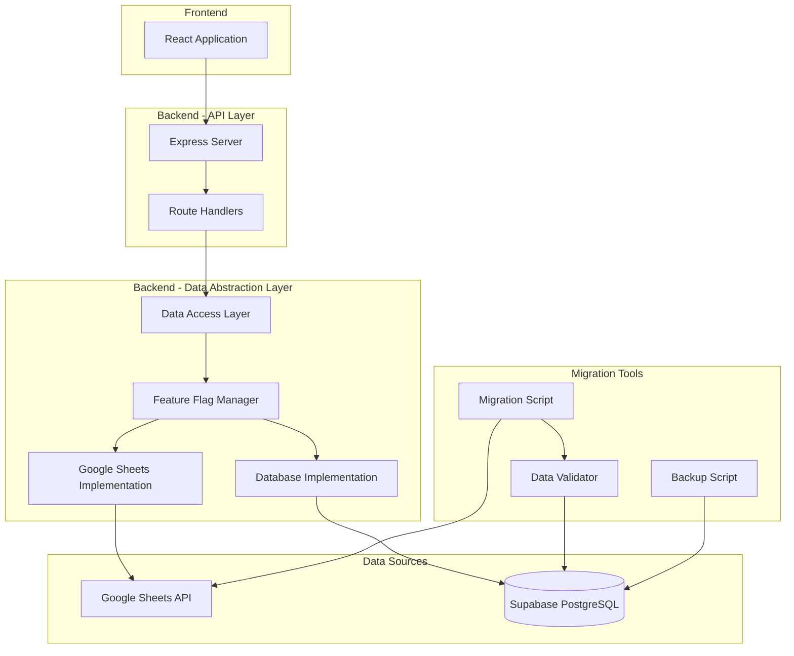

# Design Document: Hybrid Database Migration

## Overview

VIP Map Application은 현재 Google Sheets API를 주요 데이터 저장소로 사용하고 있습니다. 본 설계는 애플리케이션 내에서 빈번한 CRUD 작업이 발생하는 데이터를 Supabase (PostgreSQL) 데이터베이스로 점진적으로 마이그레이션하는 하이브리드 시스템을 구축합니다.

**핵심 설계 원칙:**
- 점진적 마이그레이션: 우선순위 모드부터 단계적으로 전환
- 하이브리드 운영: Google Sheets와 DB를 동시에 사용
- 무중단 전환: 기존 API 호환성 유지
- 롤백 가능: 문제 발생 시 Google Sheets로 복귀 가능

**마이그레이션 우선순위:**
1. **Phase 1 (검토 대상)**: 총 35개 시트 (내일 사용자와 함께 최종 선정)
   - 직영점 모드 (14개 시트)
   - 정책 모드 (10개 시트)
   - 고객 모드 (7개 시트)
   - 일반정책 모드 (1개 시트)
   - 온세일 모드 (3개 시트)
2. **Phase 2 (점진적)**: 나머지 모드들

## Architecture

### System Architecture Diagram



### Hybrid Storage Strategy

**데이터 분류 기준:**

| 데이터 유형 | 저장소 | 이유 |
|------------|--------|------|
| 빈번한 CRUD 작업 데이터 | Database | 성능, 트랜잭션 지원, 복잡한 쿼리 |
| 수동 편집이 필요한 설정 | Google Sheets | 비개발자 접근성, 스프레드시트 UI |
| 참조/설정 데이터 | Google Sheets | 변경 빈도 낮음, 시각적 관리 편의 |
| 실시간 협업 데이터 | Google Sheets | 동시 편집 기능 |

**Phase 1 마이그레이션 대상 (우선순위):**

**Phase 1 마이그레이션 대상 (검토 중 - 총 35개 시트):**

직영점 모드 (14개 시트):
- 직영점_정책_마진
- 직영점_정책_부가서비스
- 직영점_정책_보험상품
- 직영점_정책_별도
- 직영점_설정
- 직영점_메인페이지문구
- 직영점_요금제마스터
- 직영점_단말마스터
- 직영점_단말요금정책
- 직영점_모델이미지
- 직영점_오늘의휴대폰
- 직영점_대중교통위치
- 직영점_매장사진
- 직영점_판매일보

정책 모드 (10개 시트):
- 정책모드_정책표설정
- 정책모드_정책표목록
- 정책모드_일반사용자그룹
- 정책표목록_탭순서
- 정책모드_정책영업그룹_변경이력
- 정책모드_기본정책영업그룹
- 정책모드_기타정책목록
- 예산모드_예산채널설정
- 예산모드_기본예산설정
- 예산모드_기본데이터설정

고객 모드 (7개 시트):
- 고객정보
- 구매대기
- 게시판
- 직영점_사전승낙서마크
- 예약판매전체고객
- 예약판매고객
- 미매칭고객

일반정책 모드 (1개 시트):
- 일반모드권한관리

온세일 모드 (3개 시트):
- 개통정보
- 온세일링크
- 정책게시판

**참고:** 위 시트 목록은 검토 대상이며, 내일 사용자와 함께 실제 마이그레이션 대상을 최종 선정할 예정입니다.


## Supabase Setup Guide

### Step 1: Account Creation and Project Setup

1. **Supabase 계정 생성**
   - https://supabase.com 방문
   - "Start your project" 클릭
   - GitHub 또는 이메일로 가입

2. **새 프로젝트 생성**
   - Dashboard에서 "New Project" 클릭
   - Project name: `vip-map-production` (또는 원하는 이름)
   - Database Password: 강력한 비밀번호 생성 (안전하게 보관)
   - Region: `Northeast Asia (Seoul)` 선택 (한국 서버)
   - Pricing Plan: `Free` 선택
   - "Create new project" 클릭

3. **프로젝트 생성 대기**
   - 프로젝트 생성에 약 2분 소요
   - 완료되면 자동으로 프로젝트 대시보드로 이동

### Step 2: Connection Credentials 확인

1. **API 설정 페이지 접근**
   - 좌측 메뉴에서 "Settings" (톱니바퀴 아이콘) 클릭
   - "API" 탭 선택

2. **필요한 정보 복사**
   - **Project URL**: `https://xxxxx.supabase.co` 형식
   - **anon public key**: `eyJhbGc...` 형식의 긴 토큰
   - 또는 **service_role key**: 서버 사이드 작업용 (더 많은 권한)

3. **환경 변수 설정**
   ```bash
   # server/.env 파일에 추가
   SUPABASE_URL=https://xxxxx.supabase.co
   SUPABASE_KEY=eyJhbGc...  # service_role key 사용 권장
   ```

### Step 3: Database 접근 및 관리

1. **Table Editor 사용**
   - 좌측 메뉴에서 "Table Editor" 클릭
   - GUI로 테이블 생성, 데이터 조회/수정 가능
   - 엑셀과 유사한 인터페이스

2. **SQL Editor 사용**
   - 좌측 메뉴에서 "SQL Editor" 클릭
   - 직접 SQL 쿼리 실행 가능
   - 마이그레이션 스크립트 실행에 사용

3. **Database 설정**
   - "Settings" > "Database" 에서 연결 정보 확인
   - Connection string, Connection pooling 설정 가능

### Step 4: Supabase Client 라이브러리 설치

```bash
cd server
npm install @supabase/supabase-js
```

### Step 5: 기본 연결 테스트

```javascript
// server/supabaseClient.js
const { createClient } = require('@supabase/supabase-js');

const supabaseUrl = process.env.SUPABASE_URL;
const supabaseKey = process.env.SUPABASE_KEY;

const supabase = createClient(supabaseUrl, supabaseKey);

// 연결 테스트
async function testConnection() {
  const { data, error } = await supabase
    .from('_test_table')
    .select('*')
    .limit(1);
  
  if (error && error.code !== 'PGRST116') { // 테이블 없음 에러는 무시
    console.error('Supabase connection failed:', error);
    return false;
  }
  
  console.log('Supabase connection successful!');
  return true;
}

module.exports = { supabase, testConnection };
```

### Supabase Free Tier 제한사항

- **Database**: 500MB 저장 공간
- **API Requests**: 무제한
- **Bandwidth**: 5GB/월
- **File Storage**: 1GB
- **Realtime**: 200 concurrent connections
- **Edge Functions**: 500,000 invocations/월
- **Automatic Backups**: 7일 보관 (자동)

**참고**: 현재 시스템의 23개 시트 데이터는 500MB 이내로 충분히 수용 가능합니다.


## Components and Interfaces

### 1. Data Access Layer (DAL)

데이터 소스를 추상화하여 Google Sheets와 Database를 통일된 인터페이스로 접근합니다.

```javascript
// server/dal/DataAccessLayer.js

class DataAccessLayer {
  constructor(implementation) {
    this.implementation = implementation; // GoogleSheetsImpl or DatabaseImpl
  }

  // CRUD Operations
  async create(entity, data) {
    return await this.implementation.create(entity, data);
  }

  async read(entity, filters = {}) {
    return await this.implementation.read(entity, filters);
  }

  async update(entity, id, data) {
    return await this.implementation.update(entity, id, data);
  }

  async delete(entity, id) {
    return await this.implementation.delete(entity, id);
  }

  // Batch Operations
  async batchCreate(entity, dataArray) {
    return await this.implementation.batchCreate(entity, dataArray);
  }

  // Transaction Support (DB only)
  async transaction(callback) {
    if (this.implementation.transaction) {
      return await this.implementation.transaction(callback);
    }
    throw new Error('Transactions not supported by this implementation');
  }
}

module.exports = DataAccessLayer;
```

### 2. Database Implementation

```javascript
// server/dal/DatabaseImplementation.js

const { supabase } = require('../supabaseClient');

class DatabaseImplementation {
  async create(entity, data) {
    const { data: result, error } = await supabase
      .from(entity)
      .insert(data)
      .select();
    
    if (error) {
      throw new Error(`DB Create Error [${entity}]: ${error.message}`);
    }
    
    return result[0];
  }

  async read(entity, filters = {}) {
    let query = supabase.from(entity).select('*');
    
    // Apply filters
    Object.entries(filters).forEach(([key, value]) => {
      query = query.eq(key, value);
    });
    
    const { data, error } = await query;
    
    if (error) {
      throw new Error(`DB Read Error [${entity}]: ${error.message}`);
    }
    
    return data;
  }

  async update(entity, id, data) {
    const { data: result, error } = await supabase
      .from(entity)
      .update(data)
      .eq('id', id)
      .select();
    
    if (error) {
      throw new Error(`DB Update Error [${entity}]: ${error.message}`);
    }
    
    return result[0];
  }

  async delete(entity, id) {
    const { error } = await supabase
      .from(entity)
      .delete()
      .eq('id', id);
    
    if (error) {
      throw new Error(`DB Delete Error [${entity}]: ${error.message}`);
    }
    
    return { success: true };
  }

  async batchCreate(entity, dataArray) {
    const { data, error } = await supabase
      .from(entity)
      .insert(dataArray)
      .select();
    
    if (error) {
      throw new Error(`DB Batch Create Error [${entity}]: ${error.message}`);
    }
    
    return data;
  }

  async transaction(callback) {
    // Supabase uses PostgreSQL transactions
    // For complex transactions, use RPC or direct SQL
    return await callback(supabase);
  }
}

module.exports = DatabaseImplementation;
```

### 3. Google Sheets Implementation

```javascript
// server/dal/GoogleSheetsImplementation.js

const { GoogleSpreadsheet } = require('google-spreadsheet');

class GoogleSheetsImplementation {
  constructor(sheetId, credentials) {
    this.sheetId = sheetId;
    this.credentials = credentials;
    this.doc = null;
  }

  async initialize() {
    if (!this.doc) {
      this.doc = new GoogleSpreadsheet(this.sheetId);
      await this.doc.useServiceAccountAuth(this.credentials);
      await this.doc.loadInfo();
    }
  }

  async create(entity, data) {
    await this.initialize();
    const sheet = this.doc.sheetsByTitle[entity];
    if (!sheet) {
      throw new Error(`Sheet not found: ${entity}`);
    }
    
    const row = await sheet.addRow(data);
    return row.toObject();
  }

  async read(entity, filters = {}) {
    await this.initialize();
    const sheet = this.doc.sheetsByTitle[entity];
    if (!sheet) {
      throw new Error(`Sheet not found: ${entity}`);
    }
    
    const rows = await sheet.getRows();
    let results = rows.map(row => row.toObject());
    
    // Apply filters
    Object.entries(filters).forEach(([key, value]) => {
      results = results.filter(item => item[key] === value);
    });
    
    return results;
  }

  async update(entity, id, data) {
    await this.initialize();
    const sheet = this.doc.sheetsByTitle[entity];
    if (!sheet) {
      throw new Error(`Sheet not found: ${entity}`);
    }
    
    const rows = await sheet.getRows();
    const row = rows.find(r => r.get('id') === id);
    
    if (!row) {
      throw new Error(`Row not found with id: ${id}`);
    }
    
    Object.entries(data).forEach(([key, value]) => {
      row.set(key, value);
    });
    
    await row.save();
    return row.toObject();
  }

  async delete(entity, id) {
    await this.initialize();
    const sheet = this.doc.sheetsByTitle[entity];
    if (!sheet) {
      throw new Error(`Sheet not found: ${entity}`);
    }
    
    const rows = await sheet.getRows();
    const row = rows.find(r => r.get('id') === id);
    
    if (!row) {
      throw new Error(`Row not found with id: ${id}`);
    }
    
    await row.delete();
    return { success: true };
  }

  async batchCreate(entity, dataArray) {
    await this.initialize();
    const sheet = this.doc.sheetsByTitle[entity];
    if (!sheet) {
      throw new Error(`Sheet not found: ${entity}`);
    }
    
    const rows = await sheet.addRows(dataArray);
    return rows.map(row => row.toObject());
  }
}

module.exports = GoogleSheetsImplementation;
```


### 4. Feature Flag Manager

모드별로 데이터 소스를 동적으로 전환합니다.

```javascript
// server/dal/FeatureFlagManager.js

class FeatureFlagManager {
  constructor() {
    // 환경 변수 또는 설정 파일에서 로드
    this.flags = {
      'direct-store': process.env.USE_DB_DIRECT_STORE === 'true',
      'policy': process.env.USE_DB_POLICY === 'true',
      'customer': process.env.USE_DB_CUSTOMER === 'true',
      // 나머지 모드는 기본적으로 false (Google Sheets 사용)
    };
  }

  isEnabled(mode) {
    return this.flags[mode] || false;
  }

  enable(mode) {
    this.flags[mode] = true;
  }

  disable(mode) {
    this.flags[mode] = false;
  }

  getAllFlags() {
    return { ...this.flags };
  }
}

module.exports = FeatureFlagManager;
```

### 5. DAL Factory

피처 플래그에 따라 적절한 구현체를 반환합니다.

```javascript
// server/dal/DALFactory.js

const DataAccessLayer = require('./DataAccessLayer');
const DatabaseImplementation = require('./DatabaseImplementation');
const GoogleSheetsImplementation = require('./GoogleSheetsImplementation');
const FeatureFlagManager = require('./FeatureFlagManager');

class DALFactory {
  constructor() {
    this.featureFlags = new FeatureFlagManager();
    this.dbImpl = new DatabaseImplementation();
    this.gsImpl = new GoogleSheetsImplementation(
      process.env.SHEET_ID,
      {
        client_email: process.env.GOOGLE_SERVICE_ACCOUNT_EMAIL,
        private_key: process.env.GOOGLE_PRIVATE_KEY.replace(/\\n/g, '\n')
      }
    );
  }

  getDAL(mode) {
    const useDatabase = this.featureFlags.isEnabled(mode);
    const implementation = useDatabase ? this.dbImpl : this.gsImpl;
    
    console.log(`[DAL] Mode: ${mode}, Using: ${useDatabase ? 'Database' : 'Google Sheets'}`);
    
    return new DataAccessLayer(implementation);
  }

  getFeatureFlags() {
    return this.featureFlags;
  }
}

// Singleton instance
const dalFactory = new DALFactory();

module.exports = dalFactory;
```


## Data Models

### Database Schema Overview

**중요**: 아래 스키마는 기본 구조만 정의되어 있습니다. 각 시트별 상세 컬럼 정의는 사용자와 함께 실제 Google Sheets 데이터를 분석하며 내일 작성할 예정입니다.

### Phase 1: Direct Store Mode Schemas (13 Tables)

#### 1. direct_store_policy_margin (직영점_정책_마진)
```sql
-- TBD: 실제 시트 분석 후 컬럼 정의
CREATE TABLE direct_store_policy_margin (
  id UUID PRIMARY KEY DEFAULT gen_random_uuid(),
  created_at TIMESTAMPTZ DEFAULT NOW(),
  updated_at TIMESTAMPTZ DEFAULT NOW(),
  -- 추가 컬럼은 시트 분석 후 정의
);
```

#### 2. direct_store_policy_addon_services (직영점_정책_부가서비스)
```sql
-- TBD: 실제 시트 분석 후 컬럼 정의
CREATE TABLE direct_store_policy_addon_services (
  id UUID PRIMARY KEY DEFAULT gen_random_uuid(),
  created_at TIMESTAMPTZ DEFAULT NOW(),
  updated_at TIMESTAMPTZ DEFAULT NOW(),
  -- 추가 컬럼은 시트 분석 후 정의
);
```

#### 3. direct_store_policy_insurance (직영점_정책_보험상품)
```sql
-- TBD: 실제 시트 분석 후 컬럼 정의
CREATE TABLE direct_store_policy_insurance (
  id UUID PRIMARY KEY DEFAULT gen_random_uuid(),
  created_at TIMESTAMPTZ DEFAULT NOW(),
  updated_at TIMESTAMPTZ DEFAULT NOW(),
  -- 추가 컬럼은 시트 분석 후 정의
);
```

#### 4. direct_store_policy_special (직영점_정책_별도)
```sql
-- TBD: 실제 시트 분석 후 컬럼 정의
CREATE TABLE direct_store_policy_special (
  id UUID PRIMARY KEY DEFAULT gen_random_uuid(),
  created_at TIMESTAMPTZ DEFAULT NOW(),
  updated_at TIMESTAMPTZ DEFAULT NOW(),
  -- 추가 컬럼은 시트 분석 후 정의
);
```

#### 5. direct_store_settings (직영점_설정)
```sql
-- TBD: 실제 시트 분석 후 컬럼 정의
CREATE TABLE direct_store_settings (
  id UUID PRIMARY KEY DEFAULT gen_random_uuid(),
  created_at TIMESTAMPTZ DEFAULT NOW(),
  updated_at TIMESTAMPTZ DEFAULT NOW(),
  -- 추가 컬럼은 시트 분석 후 정의
);
```

#### 6. direct_store_main_page_texts (직영점_메인페이지문구)
```sql
-- TBD: 실제 시트 분석 후 컬럼 정의
CREATE TABLE direct_store_main_page_texts (
  id UUID PRIMARY KEY DEFAULT gen_random_uuid(),
  created_at TIMESTAMPTZ DEFAULT NOW(),
  updated_at TIMESTAMPTZ DEFAULT NOW(),
  -- 추가 컬럼은 시트 분석 후 정의
);
```

#### 7. direct_store_plan_master (직영점_요금제마스터)
```sql
-- TBD: 실제 시트 분석 후 컬럼 정의
CREATE TABLE direct_store_plan_master (
  id UUID PRIMARY KEY DEFAULT gen_random_uuid(),
  created_at TIMESTAMPTZ DEFAULT NOW(),
  updated_at TIMESTAMPTZ DEFAULT NOW(),
  -- 추가 컬럼은 시트 분석 후 정의
);
```

#### 8. direct_store_device_master (직영점_단말마스터)
```sql
-- TBD: 실제 시트 분석 후 컬럼 정의
CREATE TABLE direct_store_device_master (
  id UUID PRIMARY KEY DEFAULT gen_random_uuid(),
  created_at TIMESTAMPTZ DEFAULT NOW(),
  updated_at TIMESTAMPTZ DEFAULT NOW(),
  -- 추가 컬럼은 시트 분석 후 정의
);
```

#### 9. direct_store_device_pricing_policy (직영점_단말요금정책)
```sql
-- TBD: 실제 시트 분석 후 컬럼 정의
CREATE TABLE direct_store_device_pricing_policy (
  id UUID PRIMARY KEY DEFAULT gen_random_uuid(),
  created_at TIMESTAMPTZ DEFAULT NOW(),
  updated_at TIMESTAMPTZ DEFAULT NOW(),
  -- 추가 컬럼은 시트 분석 후 정의
);
```

#### 10. direct_store_model_images (직영점_모델이미지)
```sql
-- TBD: 실제 시트 분석 후 컬럼 정의
CREATE TABLE direct_store_model_images (
  id UUID PRIMARY KEY DEFAULT gen_random_uuid(),
  created_at TIMESTAMPTZ DEFAULT NOW(),
  updated_at TIMESTAMPTZ DEFAULT NOW(),
  -- 추가 컬럼은 시트 분석 후 정의
);
```

#### 11. direct_store_todays_mobiles (직영점_오늘의휴대폰)
```sql
-- TBD: 실제 시트 분석 후 컬럼 정의
CREATE TABLE direct_store_todays_mobiles (
  id UUID PRIMARY KEY DEFAULT gen_random_uuid(),
  created_at TIMESTAMPTZ DEFAULT NOW(),
  updated_at TIMESTAMPTZ DEFAULT NOW(),
  -- 추가 컬럼은 시트 분석 후 정의
);
```

#### 12. direct_store_transit_locations (직영점_대중교통위치)
```sql
-- TBD: 실제 시트 분석 후 컬럼 정의
CREATE TABLE direct_store_transit_locations (
  id UUID PRIMARY KEY DEFAULT gen_random_uuid(),
  created_at TIMESTAMPTZ DEFAULT NOW(),
  updated_at TIMESTAMPTZ DEFAULT NOW(),
  -- 추가 컬럼은 시트 분석 후 정의
);
```

#### 13. direct_store_photos (직영점_매장사진)
```sql
-- TBD: 실제 시트 분석 후 컬럼 정의
CREATE TABLE direct_store_photos (
  id UUID PRIMARY KEY DEFAULT gen_random_uuid(),
  created_at TIMESTAMPTZ DEFAULT NOW(),
  updated_at TIMESTAMPTZ DEFAULT NOW(),
  -- 추가 컬럼은 시트 분석 후 정의
);
```

### Phase 1: Policy Mode Schemas (10 Tables)

#### 1. policy_table_settings (정책모드_정책표설정)
```sql
-- TBD: 실제 시트 분석 후 컬럼 정의
CREATE TABLE policy_table_settings (
  id UUID PRIMARY KEY DEFAULT gen_random_uuid(),
  created_at TIMESTAMPTZ DEFAULT NOW(),
  updated_at TIMESTAMPTZ DEFAULT NOW(),
  -- 추가 컬럼은 시트 분석 후 정의
);
```

#### 2. policy_table_list (정책모드_정책표목록)
```sql
-- TBD: 실제 시트 분석 후 컬럼 정의
CREATE TABLE policy_table_list (
  id UUID PRIMARY KEY DEFAULT gen_random_uuid(),
  created_at TIMESTAMPTZ DEFAULT NOW(),
  updated_at TIMESTAMPTZ DEFAULT NOW(),
  -- 추가 컬럼은 시트 분석 후 정의
);
```

#### 3. policy_user_groups (정책모드_일반사용자그룹)
```sql
-- TBD: 실제 시트 분석 후 컬럼 정의
CREATE TABLE policy_user_groups (
  id UUID PRIMARY KEY DEFAULT gen_random_uuid(),
  created_at TIMESTAMPTZ DEFAULT NOW(),
  updated_at TIMESTAMPTZ DEFAULT NOW(),
  -- 추가 컬럼은 시트 분석 후 정의
);
```

#### 4. policy_tab_order (정책표목록_탭순서)
```sql
-- TBD: 실제 시트 분석 후 컬럼 정의
CREATE TABLE policy_tab_order (
  id UUID PRIMARY KEY DEFAULT gen_random_uuid(),
  created_at TIMESTAMPTZ DEFAULT NOW(),
  updated_at TIMESTAMPTZ DEFAULT NOW(),
  -- 추가 컬럼은 시트 분석 후 정의
);
```

#### 5. policy_group_change_history (정책모드_정책영업그룹_변경이력)
```sql
-- TBD: 실제 시트 분석 후 컬럼 정의
CREATE TABLE policy_group_change_history (
  id UUID PRIMARY KEY DEFAULT gen_random_uuid(),
  created_at TIMESTAMPTZ DEFAULT NOW(),
  updated_at TIMESTAMPTZ DEFAULT NOW(),
  -- 추가 컬럼은 시트 분석 후 정의
);
```

#### 6. policy_default_groups (정책모드_기본정책영업그룹)
```sql
-- TBD: 실제 시트 분석 후 컬럼 정의
CREATE TABLE policy_default_groups (
  id UUID PRIMARY KEY DEFAULT gen_random_uuid(),
  created_at TIMESTAMPTZ DEFAULT NOW(),
  updated_at TIMESTAMPTZ DEFAULT NOW(),
  -- 추가 컬럼은 시트 분석 후 정의
);
```

#### 7. policy_other_types (정책모드_기타정책목록)
```sql
-- TBD: 실제 시트 분석 후 컬럼 정의
CREATE TABLE policy_other_types (
  id UUID PRIMARY KEY DEFAULT gen_random_uuid(),
  created_at TIMESTAMPTZ DEFAULT NOW(),
  updated_at TIMESTAMPTZ DEFAULT NOW(),
  -- 추가 컬럼은 시트 분석 후 정의
);
```

#### 8. budget_channel_settings (예산모드_예산채널설정)
```sql
-- TBD: 실제 시트 분석 후 컬럼 정의
CREATE TABLE budget_channel_settings (
  id UUID PRIMARY KEY DEFAULT gen_random_uuid(),
  created_at TIMESTAMPTZ DEFAULT NOW(),
  updated_at TIMESTAMPTZ DEFAULT NOW(),
  -- 추가 컬럼은 시트 분석 후 정의
);
```

#### 9. budget_basic_settings (예산모드_기본예산설정)
```sql
-- TBD: 실제 시트 분석 후 컬럼 정의
CREATE TABLE budget_basic_settings (
  id UUID PRIMARY KEY DEFAULT gen_random_uuid(),
  created_at TIMESTAMPTZ DEFAULT NOW(),
  updated_at TIMESTAMPTZ DEFAULT NOW(),
  -- 추가 컬럼은 시트 분석 후 정의
);
```

#### 10. budget_basic_data_settings (예산모드_기본데이터설정)
```sql
-- TBD: 실제 시트 분석 후 컬럼 정의
CREATE TABLE budget_basic_data_settings (
  id UUID PRIMARY KEY DEFAULT gen_random_uuid(),
  created_at TIMESTAMPTZ DEFAULT NOW(),
  updated_at TIMESTAMPTZ DEFAULT NOW(),
  -- 추가 컬럼은 시트 분석 후 정의
);
```

### Common Schema Patterns

모든 테이블에 공통적으로 적용될 패턴:

```sql
-- 1. 자동 타임스탬프 업데이트 트리거
CREATE OR REPLACE FUNCTION update_updated_at_column()
RETURNS TRIGGER AS $$
BEGIN
  NEW.updated_at = NOW();
  RETURN NEW;
END;
$$ language 'plpgsql';

-- 각 테이블에 적용
CREATE TRIGGER update_{table_name}_updated_at 
  BEFORE UPDATE ON {table_name}
  FOR EACH ROW 
  EXECUTE FUNCTION update_updated_at_column();

-- 2. Row Level Security (RLS) 설정 예시
ALTER TABLE {table_name} ENABLE ROW LEVEL SECURITY;

-- 3. 인덱스 생성 (자주 조회되는 컬럼)
CREATE INDEX idx_{table_name}_{column_name} ON {table_name}({column_name});
```


## Migration Strategy

### Migration Script Architecture

```javascript
// server/migration/MigrationScript.js

const { GoogleSpreadsheet } = require('google-spreadsheet');
const { supabase } = require('../supabaseClient');
const DataValidator = require('./DataValidator');

class MigrationScript {
  constructor(options = {}) {
    this.dryRun = options.dryRun || false;
    this.validator = new DataValidator();
    this.stats = {
      total: 0,
      success: 0,
      failed: 0,
      errors: []
    };
  }

  async migrateSheet(sheetName, tableName, transformFn = null) {
    console.log(`\n[Migration] Starting: ${sheetName} -> ${tableName}`);
    console.log(`[Migration] Dry Run: ${this.dryRun}`);

    try {
      // 1. Google Sheets에서 데이터 읽기
      const doc = new GoogleSpreadsheet(process.env.SHEET_ID);
      await doc.useServiceAccountAuth({
        client_email: process.env.GOOGLE_SERVICE_ACCOUNT_EMAIL,
        private_key: process.env.GOOGLE_PRIVATE_KEY.replace(/\\n/g, '\n')
      });
      await doc.loadInfo();

      const sheet = doc.sheetsByTitle[sheetName];
      if (!sheet) {
        throw new Error(`Sheet not found: ${sheetName}`);
      }

      const rows = await sheet.getRows();
      this.stats.total = rows.length;

      console.log(`[Migration] Found ${rows.length} rows`);

      // 2. 각 행 처리
      for (const row of rows) {
        try {
          let data = row.toObject();

          // 3. 데이터 변환 (필요시)
          if (transformFn) {
            data = transformFn(data);
          }

          // 4. 데이터 검증
          const validation = this.validator.validate(tableName, data);
          if (!validation.valid) {
            throw new Error(`Validation failed: ${validation.errors.join(', ')}`);
          }

          // 5. DB에 삽입 (dry-run이 아닐 때만)
          if (!this.dryRun) {
            const { error } = await supabase
              .from(tableName)
              .insert(data);

            if (error) {
              throw error;
            }
          }

          this.stats.success++;

        } catch (error) {
          this.stats.failed++;
          this.stats.errors.push({
            row: row.rowNumber,
            error: error.message,
            data: row.toObject()
          });

          console.error(`[Migration] Row ${row.rowNumber} failed:`, error.message);
          // 계속 진행
        }
      }

      // 6. 결과 출력
      this.printStats(sheetName, tableName);

      return this.stats;

    } catch (error) {
      console.error(`[Migration] Fatal error:`, error);
      throw error;
    }
  }

  printStats(sheetName, tableName) {
    console.log(`\n[Migration] Results for ${sheetName}:`);
    console.log(`  Total rows: ${this.stats.total}`);
    console.log(`  Successful: ${this.stats.success}`);
    console.log(`  Failed: ${this.stats.failed}`);
    
    if (this.stats.errors.length > 0) {
      console.log(`\n[Migration] Errors:`);
      this.stats.errors.forEach((err, idx) => {
        console.log(`  ${idx + 1}. Row ${err.row}: ${err.error}`);
      });
    }

    if (this.dryRun) {
      console.log(`\n[Migration] DRY RUN - No data was actually inserted`);
    }
  }

  async migrateAll(migrations) {
    const results = {};

    for (const migration of migrations) {
      const { sheetName, tableName, transformFn } = migration;
      
      try {
        results[tableName] = await this.migrateSheet(
          sheetName,
          tableName,
          transformFn
        );
      } catch (error) {
        results[tableName] = {
          error: error.message,
          stats: this.stats
        };
      }

      // 통계 초기화
      this.stats = {
        total: 0,
        success: 0,
        failed: 0,
        errors: []
      };
    }

    return results;
  }
}

module.exports = MigrationScript;
```

### Data Validator

```javascript
// server/migration/DataValidator.js

class DataValidator {
  constructor() {
    // 테이블별 검증 규칙 (실제 스키마 정의 후 구체화)
    this.rules = {
      // TBD: 각 테이블별 검증 규칙
    };
  }

  validate(tableName, data) {
    const errors = [];

    // 기본 검증
    if (!data || typeof data !== 'object') {
      errors.push('Data must be an object');
      return { valid: false, errors };
    }

    // 테이블별 검증 규칙 적용
    const tableRules = this.rules[tableName];
    if (tableRules) {
      // TBD: 규칙 적용 로직
    }

    return {
      valid: errors.length === 0,
      errors
    };
  }

  addRule(tableName, rule) {
    if (!this.rules[tableName]) {
      this.rules[tableName] = [];
    }
    this.rules[tableName].push(rule);
  }
}

module.exports = DataValidator;
```

### Migration Execution Script

```javascript
// server/migration/runMigration.js

const MigrationScript = require('./MigrationScript');

// Phase 1 마이그레이션 정의
const phase1Migrations = [
  // Direct Store Mode (13 sheets)
  { sheetName: '직영점_정책_마진', tableName: 'direct_store_policy_margin' },
  { sheetName: '직영점_정책_부가서비스', tableName: 'direct_store_policy_addon_services' },
  { sheetName: '직영점_정책_보험상품', tableName: 'direct_store_policy_insurance' },
  { sheetName: '직영점_정책_별도', tableName: 'direct_store_policy_special' },
  { sheetName: '직영점_설정', tableName: 'direct_store_settings' },
  { sheetName: '직영점_메인페이지문구', tableName: 'direct_store_main_page_texts' },
  { sheetName: '직영점_요금제마스터', tableName: 'direct_store_plan_master' },
  { sheetName: '직영점_단말마스터', tableName: 'direct_store_device_master' },
  { sheetName: '직영점_단말요금정책', tableName: 'direct_store_device_pricing_policy' },
  { sheetName: '직영점_모델이미지', tableName: 'direct_store_model_images' },
  { sheetName: '직영점_오늘의휴대폰', tableName: 'direct_store_todays_mobiles' },
  { sheetName: '직영점_대중교통위치', tableName: 'direct_store_transit_locations' },
  { sheetName: '직영점_매장사진', tableName: 'direct_store_photos' },
  
  // Policy Mode (10 sheets)
  { sheetName: '정책모드_정책표설정', tableName: 'policy_table_settings' },
  { sheetName: '정책모드_정책표목록', tableName: 'policy_table_list' },
  { sheetName: '정책모드_일반사용자그룹', tableName: 'policy_user_groups' },
  { sheetName: '정책표목록_탭순서', tableName: 'policy_tab_order' },
  { sheetName: '정책모드_정책영업그룹_변경이력', tableName: 'policy_group_change_history' },
  { sheetName: '정책모드_기본정책영업그룹', tableName: 'policy_default_groups' },
  { sheetName: '정책모드_기타정책목록', tableName: 'policy_other_types' },
  { sheetName: '예산모드_예산채널설정', tableName: 'budget_channel_settings' },
  { sheetName: '예산모드_기본예산설정', tableName: 'budget_basic_settings' },
  { sheetName: '예산모드_기본데이터설정', tableName: 'budget_basic_data_settings' }
];

async function main() {
  const dryRun = process.argv.includes('--dry-run');
  
  console.log('='.repeat(60));
  console.log('VIP Map - Database Migration Script');
  console.log('='.repeat(60));
  console.log(`Mode: ${dryRun ? 'DRY RUN' : 'LIVE'}`);
  console.log(`Migrations: ${phase1Migrations.length} sheets`);
  console.log('='.repeat(60));

  const migrator = new MigrationScript({ dryRun });
  const results = await migrator.migrateAll(phase1Migrations);

  // 전체 결과 요약
  console.log('\n' + '='.repeat(60));
  console.log('Migration Summary');
  console.log('='.repeat(60));
  
  let totalSuccess = 0;
  let totalFailed = 0;

  Object.entries(results).forEach(([tableName, result]) => {
    if (result.error) {
      console.log(`❌ ${tableName}: ERROR - ${result.error}`);
    } else {
      console.log(`✅ ${tableName}: ${result.success}/${result.total} rows`);
      totalSuccess += result.success;
      totalFailed += result.failed;
    }
  });

  console.log('='.repeat(60));
  console.log(`Total Success: ${totalSuccess}`);
  console.log(`Total Failed: ${totalFailed}`);
  console.log('='.repeat(60));
}

// 실행
if (require.main === module) {
  main().catch(console.error);
}

module.exports = { phase1Migrations };
```


## API Endpoint Updates

### Update Strategy

기존 API 엔드포인트를 수정하여 DAL을 사용하도록 변경합니다. 요청/응답 형식은 동일하게 유지하여 프론트엔드 변경을 최소화합니다.

### Example: Direct Store Routes Update

**Before (Google Sheets):**
```javascript
// server/directRoutes.js (기존)
router.get('/api/direct/policy/margin', async (req, res) => {
  try {
    const doc = new GoogleSpreadsheet(process.env.SHEET_ID);
    await doc.useServiceAccountAuth(credentials);
    await doc.loadInfo();
    
    const sheet = doc.sheetsByTitle['직영점_정책_마진'];
    const rows = await sheet.getRows();
    const data = rows.map(row => row.toObject());
    
    res.json({ success: true, data });
  } catch (error) {
    res.status(500).json({ success: false, error: error.message });
  }
});
```

**After (DAL with Feature Flag):**
```javascript
// server/directRoutes.js (수정)
const dalFactory = require('./dal/DALFactory');

router.get('/api/direct/policy/margin', async (req, res) => {
  try {
    const dal = dalFactory.getDAL('direct-store');
    const data = await dal.read('direct_store_policy_margin');
    
    res.json({ success: true, data });
  } catch (error) {
    console.error('[API] Error fetching policy margin:', error);
    res.status(500).json({ success: false, error: error.message });
  }
});

router.post('/api/direct/policy/margin', async (req, res) => {
  try {
    const dal = dalFactory.getDAL('direct-store');
    const result = await dal.create('direct_store_policy_margin', req.body);
    
    res.json({ success: true, data: result });
  } catch (error) {
    console.error('[API] Error creating policy margin:', error);
    res.status(500).json({ success: false, error: error.message });
  }
});

router.put('/api/direct/policy/margin/:id', async (req, res) => {
  try {
    const dal = dalFactory.getDAL('direct-store');
    const result = await dal.update('direct_store_policy_margin', req.params.id, req.body);
    
    res.json({ success: true, data: result });
  } catch (error) {
    console.error('[API] Error updating policy margin:', error);
    res.status(500).json({ success: false, error: error.message });
  }
});

router.delete('/api/direct/policy/margin/:id', async (req, res) => {
  try {
    const dal = dalFactory.getDAL('direct-store');
    await dal.delete('direct_store_policy_margin', req.params.id);
    
    res.json({ success: true });
  } catch (error) {
    console.error('[API] Error deleting policy margin:', error);
    res.status(500).json({ success: false, error: error.message });
  }
});
```

### API Routes to Update

**Direct Store Mode (directRoutes.js):**
- GET/POST/PUT/DELETE `/api/direct/policy/*` - 정책 관련 엔드포인트
- GET/POST/PUT/DELETE `/api/direct/settings` - 설정
- GET/POST/PUT/DELETE `/api/direct/plans` - 요금제
- GET/POST/PUT/DELETE `/api/direct/devices` - 단말기
- GET/POST/PUT/DELETE `/api/direct/images` - 이미지
- GET/POST/PUT/DELETE `/api/direct/locations` - 위치 정보

**Policy Mode (policyTableRoutes.js):**
- GET/POST/PUT/DELETE `/api/policy/tables` - 정책표
- GET/POST/PUT/DELETE `/api/policy/settings` - 설정
- GET/POST/PUT/DELETE `/api/policy/groups` - 그룹
- GET/POST/PUT/DELETE `/api/policy/history` - 변경 이력

**Customer Mode (memberRoutes.js, directStoreAdditionalRoutes.js, reservationRoutes.js):**
- GET/POST/PUT/DELETE `/api/member/login` - 고객 로그인
- GET/POST/PUT/DELETE `/api/member/queue` - 구매 대기 목록
- GET/POST/PUT/DELETE `/api/member/board` - 게시판
- GET/POST `/api/direct/pre-approval` - 사전승낙서
- GET `/api/reservation/customers` - 예약 고객 목록
- GET `/api/mismatched-customers` - 미매칭 고객

### Backward Compatibility

모든 API 응답은 기존 형식을 유지합니다:

```javascript
// 성공 응답
{
  "success": true,
  "data": [...] or {...}
}

// 에러 응답
{
  "success": false,
  "error": "Error message"
}
```


## Gradual Rollout Plan

### Phase 1: Infrastructure Setup (Week 1)

1. **Supabase 프로젝트 생성 및 설정**
   - 계정 생성, 프로젝트 초기화
   - 환경 변수 설정
   - 연결 테스트

2. **DAL 구현**
   - DataAccessLayer 클래스
   - DatabaseImplementation
   - GoogleSheetsImplementation
   - FeatureFlagManager
   - DALFactory

3. **테스트 환경 구축**
   - Jest 설정
   - fast-check 설정
   - 테스트 데이터 준비

### Phase 2: Schema Definition & Migration (Week 2)

1. **스키마 정의 (사용자와 협업)**
   - 각 시트의 실제 데이터 분석
   - 컬럼 타입, 제약조건 정의
   - 관계 정의 (Foreign Keys)
   - 인덱스 설계

2. **마이그레이션 스크립트 작성**
   - MigrationScript 구현
   - DataValidator 구현
   - 변환 함수 작성 (필요시)

3. **Dry-run 테스트**
   - 모든 시트에 대해 dry-run 실행
   - 데이터 검증 오류 수정
   - 변환 로직 조정

### Phase 3: Direct Store Mode Migration (Week 3)

1. **데이터 마이그레이션 실행**
   - 13개 시트 마이그레이션
   - 데이터 무결성 검증
   - 백업 생성

2. **API 엔드포인트 업데이트**
   - directRoutes.js 수정
   - 통합 테스트 작성 및 실행

3. **Feature Flag 활성화**
   ```bash
   # server/.env
   USE_DB_DIRECT_STORE=false  # 초기에는 false
   ```

4. **점진적 활성화**
   - 개발 환경에서 테스트
   - 스테이징 환경에서 검증
   - 프로덕션에서 일부 사용자 대상 테스트
   - 전체 활성화

### Phase 4: Customer Mode Migration (Week 4)

1. **데이터 마이그레이션 실행**
   - 7개 시트 마이그레이션
   - 데이터 무결성 검증

2. **API 엔드포인트 업데이트**
   - memberRoutes.js, directStoreAdditionalRoutes.js, reservationRoutes.js 수정
   - 통합 테스트

3. **Feature Flag 활성화**
   ```bash
   # server/.env
   USE_DB_CUSTOMER=false  # 초기에는 false
   ```

4. **점진적 활성화**
   - 동일한 롤아웃 프로세스

### Phase 5: Policy Mode Migration (Week 5)

1. **데이터 마이그레이션 실행**
   - 10개 시트 마이그레이션
   - 데이터 무결성 검증

2. **API 엔드포인트 업데이트**
   - policyTableRoutes.js 수정
   - 통합 테스트

3. **Feature Flag 활성화**
   ```bash
   # server/.env
   USE_DB_POLICY=false  # 초기에는 false
   ```

4. **점진적 활성화**
   - 동일한 롤아웃 프로세스

### Phase 5: Policy Mode Migration (Week 5)

1. **데이터 마이그레이션 실행**
   - 10개 시트 마이그레이션
   - 데이터 무결성 검증

2. **API 엔드포인트 업데이트**
   - policyTableRoutes.js 수정
   - 통합 테스트

3. **Feature Flag 활성화**
   ```bash
   # server/.env
   USE_DB_POLICY=false  # 초기에는 false
   ```

4. **점진적 활성화**
   - 동일한 롤아웃 프로세스

### Phase 6: Remaining Modes (Week 6+)

### Rollback Strategy

각 단계에서 문제 발생 시 롤백 절차:

```javascript
// server/dal/FeatureFlagManager.js
// 환경 변수 변경으로 즉시 롤백 가능

// 롤백 방법 1: 환경 변수 변경
USE_DB_DIRECT_STORE=false  // Google Sheets로 복귀

// 롤백 방법 2: API를 통한 동적 변경
router.post('/api/admin/feature-flags/:mode/disable', async (req, res) => {
  const { mode } = req.params;
  dalFactory.getFeatureFlags().disable(mode);
  res.json({ success: true, message: `${mode} rolled back to Google Sheets` });
});
```

### Monitoring During Rollout

```javascript
// server/middleware/monitoringMiddleware.js

const monitoringMiddleware = (req, res, next) => {
  const startTime = Date.now();
  
  res.on('finish', () => {
    const duration = Date.now() - startTime;
    const mode = req.path.split('/')[2]; // /api/{mode}/...
    
    // 성능 로깅
    if (duration > 1000) {
      console.warn(`[Performance] Slow request: ${req.method} ${req.path} - ${duration}ms`);
    }
    
    // 에러율 추적
    if (res.statusCode >= 500) {
      console.error(`[Error] ${req.method} ${req.path} - Status: ${res.statusCode}`);
    }
    
    // 메트릭 수집 (Discord, 모니터링 서비스 등)
    // TBD: 실제 모니터링 시스템 연동
  });
  
  next();
};

module.exports = monitoringMiddleware;
```


## Backup and Recovery

### Automated Backup Strategy

```javascript
// server/backup/BackupScript.js

const { supabase } = require('../supabaseClient');
const fs = require('fs').promises;
const path = require('path');

class BackupScript {
  constructor() {
    this.backupDir = path.join(__dirname, '../../backups');
  }

  async ensureBackupDirectory() {
    try {
      await fs.mkdir(this.backupDir, { recursive: true });
    } catch (error) {
      console.error('Failed to create backup directory:', error);
    }
  }

  async backupTable(tableName) {
    console.log(`[Backup] Starting backup for ${tableName}`);
    
    try {
      // 모든 데이터 조회
      const { data, error } = await supabase
        .from(tableName)
        .select('*');
      
      if (error) {
        throw error;
      }

      // 파일명: {tableName}_{timestamp}.json
      const timestamp = new Date().toISOString().replace(/[:.]/g, '-');
      const filename = `${tableName}_${timestamp}.json`;
      const filepath = path.join(this.backupDir, filename);

      // JSON 파일로 저장
      await fs.writeFile(
        filepath,
        JSON.stringify(data, null, 2),
        'utf8'
      );

      console.log(`[Backup] Saved to ${filename} (${data.length} rows)`);
      
      return {
        success: true,
        filename,
        rowCount: data.length
      };

    } catch (error) {
      console.error(`[Backup] Failed for ${tableName}:`, error);
      return {
        success: false,
        error: error.message
      };
    }
  }

  async backupAll(tables) {
    await this.ensureBackupDirectory();
    
    const results = {};
    
    for (const tableName of tables) {
      results[tableName] = await this.backupTable(tableName);
    }
    
    return results;
  }

  async cleanOldBackups(retentionDays = 30) {
    console.log(`[Backup] Cleaning backups older than ${retentionDays} days`);
    
    try {
      const files = await fs.readdir(this.backupDir);
      const now = Date.now();
      const maxAge = retentionDays * 24 * 60 * 60 * 1000;
      
      let deletedCount = 0;
      
      for (const file of files) {
        const filepath = path.join(this.backupDir, file);
        const stats = await fs.stat(filepath);
        const age = now - stats.mtimeMs;
        
        if (age > maxAge) {
          await fs.unlink(filepath);
          deletedCount++;
          console.log(`[Backup] Deleted old backup: ${file}`);
        }
      }
      
      console.log(`[Backup] Cleaned ${deletedCount} old backups`);
      
    } catch (error) {
      console.error('[Backup] Cleanup failed:', error);
    }
  }
}

module.exports = BackupScript;
```

### Restore Script

```javascript
// server/backup/RestoreScript.js

const { supabase } = require('../supabaseClient');
const fs = require('fs').promises;
const path = require('path');

class RestoreScript {
  constructor() {
    this.backupDir = path.join(__dirname, '../../backups');
  }

  async restoreTable(tableName, filename) {
    console.log(`[Restore] Starting restore for ${tableName} from ${filename}`);
    
    try {
      // 백업 파일 읽기
      const filepath = path.join(this.backupDir, filename);
      const fileContent = await fs.readFile(filepath, 'utf8');
      const data = JSON.parse(fileContent);

      console.log(`[Restore] Loaded ${data.length} rows from backup`);

      // 기존 데이터 삭제 (선택적)
      const confirmDelete = process.argv.includes('--delete-existing');
      if (confirmDelete) {
        console.log(`[Restore] Deleting existing data from ${tableName}`);
        const { error: deleteError } = await supabase
          .from(tableName)
          .delete()
          .neq('id', '00000000-0000-0000-0000-000000000000'); // 모든 행 삭제
        
        if (deleteError) {
          console.warn(`[Restore] Delete warning:`, deleteError);
        }
      }

      // 데이터 복원 (배치 삽입)
      const batchSize = 100;
      let restored = 0;

      for (let i = 0; i < data.length; i += batchSize) {
        const batch = data.slice(i, i + batchSize);
        
        const { error } = await supabase
          .from(tableName)
          .insert(batch);
        
        if (error) {
          console.error(`[Restore] Batch ${i / batchSize + 1} failed:`, error);
        } else {
          restored += batch.length;
          console.log(`[Restore] Progress: ${restored}/${data.length} rows`);
        }
      }

      console.log(`[Restore] Completed: ${restored}/${data.length} rows restored`);
      
      return {
        success: true,
        restored,
        total: data.length
      };

    } catch (error) {
      console.error(`[Restore] Failed:`, error);
      return {
        success: false,
        error: error.message
      };
    }
  }

  async listBackups(tableName = null) {
    try {
      const files = await fs.readdir(this.backupDir);
      
      let backups = files
        .filter(f => f.endsWith('.json'))
        .map(f => {
          const parts = f.replace('.json', '').split('_');
          const table = parts.slice(0, -1).join('_');
          const timestamp = parts[parts.length - 1];
          
          return { filename: f, table, timestamp };
        });
      
      if (tableName) {
        backups = backups.filter(b => b.table === tableName);
      }
      
      return backups.sort((a, b) => b.timestamp.localeCompare(a.timestamp));
      
    } catch (error) {
      console.error('[Restore] Failed to list backups:', error);
      return [];
    }
  }
}

module.exports = RestoreScript;
```

### Scheduled Backup (Cron Job)

```javascript
// server/backup/scheduledBackup.js

const cron = require('node-cron');
const BackupScript = require('./BackupScript');

// Phase 1 테이블 목록
const tables = [
  'direct_store_policy_margin',
  'direct_store_policy_addon_services',
  'direct_store_policy_insurance',
  'direct_store_policy_special',
  'direct_store_settings',
  'direct_store_main_page_texts',
  'direct_store_plan_master',
  'direct_store_device_master',
  'direct_store_device_pricing_policy',
  'direct_store_model_images',
  'direct_store_todays_mobiles',
  'direct_store_transit_locations',
  'direct_store_photos',
  'policy_table_settings',
  'policy_table_list',
  'policy_user_groups',
  'policy_tab_order',
  'policy_group_change_history',
  'policy_default_groups',
  'policy_other_types',
  'budget_channel_settings',
  'budget_basic_settings',
  'budget_basic_data_settings'
];

// 매일 새벽 3시에 백업 실행
cron.schedule('0 3 * * *', async () => {
  console.log('[Scheduled Backup] Starting daily backup...');
  
  const backupScript = new BackupScript();
  const results = await backupScript.backupAll(tables);
  
  // 30일 이상 된 백업 삭제
  await backupScript.cleanOldBackups(30);
  
  // 결과 요약
  const successful = Object.values(results).filter(r => r.success).length;
  const failed = Object.values(results).filter(r => !r.success).length;
  
  console.log(`[Scheduled Backup] Completed: ${successful} successful, ${failed} failed`);
  
  // Discord 알림 (선택적)
  if (process.env.DISCORD_LOGGING_ENABLED === 'true') {
    // TBD: Discord 알림 전송
  }
});

console.log('[Scheduled Backup] Cron job registered (daily at 3:00 AM)');
```


## Performance Monitoring

### Query Performance Logging

```javascript
// server/middleware/queryPerformanceMiddleware.js

class QueryPerformanceMonitor {
  constructor() {
    this.slowQueryThreshold = 1000; // 1초
    this.metrics = {
      totalQueries: 0,
      slowQueries: 0,
      averageTime: 0,
      byTable: {}
    };
  }

  async trackQuery(tableName, operation, queryFn) {
    const startTime = Date.now();
    this.metrics.totalQueries++;

    try {
      const result = await queryFn();
      const duration = Date.now() - startTime;

      // 메트릭 업데이트
      this.updateMetrics(tableName, operation, duration);

      // 느린 쿼리 로깅
      if (duration > this.slowQueryThreshold) {
        this.metrics.slowQueries++;
        console.warn(`[Performance] Slow query detected:`, {
          table: tableName,
          operation,
          duration: `${duration}ms`,
          threshold: `${this.slowQueryThreshold}ms`
        });
      }

      return result;

    } catch (error) {
      const duration = Date.now() - startTime;
      console.error(`[Performance] Query failed:`, {
        table: tableName,
        operation,
        duration: `${duration}ms`,
        error: error.message
      });
      throw error;
    }
  }

  updateMetrics(tableName, operation, duration) {
    // 테이블별 메트릭
    if (!this.metrics.byTable[tableName]) {
      this.metrics.byTable[tableName] = {
        count: 0,
        totalTime: 0,
        operations: {}
      };
    }

    const tableMetrics = this.metrics.byTable[tableName];
    tableMetrics.count++;
    tableMetrics.totalTime += duration;

    // 작업별 메트릭
    if (!tableMetrics.operations[operation]) {
      tableMetrics.operations[operation] = {
        count: 0,
        totalTime: 0,
        avgTime: 0
      };
    }

    const opMetrics = tableMetrics.operations[operation];
    opMetrics.count++;
    opMetrics.totalTime += duration;
    opMetrics.avgTime = opMetrics.totalTime / opMetrics.count;

    // 전체 평균 시간 업데이트
    const totalTime = Object.values(this.metrics.byTable)
      .reduce((sum, t) => sum + t.totalTime, 0);
    this.metrics.averageTime = totalTime / this.metrics.totalQueries;
  }

  getMetrics() {
    return {
      ...this.metrics,
      slowQueryRate: (this.metrics.slowQueries / this.metrics.totalQueries * 100).toFixed(2) + '%'
    };
  }

  reset() {
    this.metrics = {
      totalQueries: 0,
      slowQueries: 0,
      averageTime: 0,
      byTable: {}
    };
  }
}

// Singleton instance
const performanceMonitor = new QueryPerformanceMonitor();

module.exports = performanceMonitor;
```

### Database Health Check

```javascript
// server/routes/healthRoutes.js

const express = require('express');
const router = express.Router();
const { supabase } = require('../supabaseClient');
const performanceMonitor = require('../middleware/queryPerformanceMiddleware');

router.get('/api/health', async (req, res) => {
  const health = {
    status: 'healthy',
    timestamp: new Date().toISOString(),
    checks: {}
  };

  try {
    // 1. Database 연결 확인
    const dbStart = Date.now();
    const { data, error } = await supabase
      .from('direct_store_settings')
      .select('id')
      .limit(1);
    
    const dbDuration = Date.now() - dbStart;

    health.checks.database = {
      status: error ? 'unhealthy' : 'healthy',
      responseTime: `${dbDuration}ms`,
      error: error ? error.message : null
    };

    // 2. Google Sheets 연결 확인 (선택적)
    // TBD: Google Sheets 헬스 체크

    // 3. 성능 메트릭
    health.checks.performance = performanceMonitor.getMetrics();

    // 4. 디스크 사용량 (Supabase는 대시보드에서 확인)
    health.checks.storage = {
      note: 'Check Supabase dashboard for storage usage',
      limit: '500MB (free tier)'
    };

    // 전체 상태 결정
    if (health.checks.database.status === 'unhealthy') {
      health.status = 'unhealthy';
      res.status(503);
    }

    res.json(health);

  } catch (error) {
    health.status = 'unhealthy';
    health.error = error.message;
    res.status(503).json(health);
  }
});

// 성능 메트릭 조회 엔드포인트
router.get('/api/health/metrics', (req, res) => {
  const metrics = performanceMonitor.getMetrics();
  res.json(metrics);
});

// 메트릭 리셋 (관리자 전용)
router.post('/api/health/metrics/reset', (req, res) => {
  performanceMonitor.reset();
  res.json({ success: true, message: 'Metrics reset' });
});

module.exports = router;
```

### Connection Pool Monitoring

```javascript
// server/supabaseClient.js (확장)

const { createClient } = require('@supabase/supabase-js');

const supabaseUrl = process.env.SUPABASE_URL;
const supabaseKey = process.env.SUPABASE_KEY;

// Supabase 클라이언트 생성 (연결 풀 자동 관리)
const supabase = createClient(supabaseUrl, supabaseKey, {
  db: {
    schema: 'public'
  },
  auth: {
    persistSession: false // 서버 사이드에서는 세션 유지 불필요
  }
});

// 연결 테스트 함수
async function testConnection() {
  try {
    const { data, error } = await supabase
      .from('direct_store_settings')
      .select('id')
      .limit(1);
    
    if (error && error.code !== 'PGRST116') { // 테이블 없음 에러는 무시
      console.error('❌ Supabase connection failed:', error);
      return false;
    }
    
    console.log('✅ Supabase connection successful');
    return true;
  } catch (error) {
    console.error('❌ Supabase connection error:', error);
    return false;
  }
}

// 서버 시작 시 연결 테스트
testConnection();

module.exports = { supabase, testConnection };
```


## Correctness Properties

### What are Correctness Properties?

속성(Property)은 시스템의 모든 유효한 실행에서 참이어야 하는 특성이나 동작입니다. 본질적으로 시스템이 무엇을 해야 하는지에 대한 형식적 진술입니다. 속성은 사람이 읽을 수 있는 명세와 기계가 검증할 수 있는 정확성 보장 사이의 다리 역할을 합니다.

Property-based testing을 통해 이러한 속성들을 수백 개의 무작위 입력에 대해 자동으로 검증할 수 있습니다.

### Property 1: Data Validation Consistency

*For any* table and any data record, when the migration script validates the data, the validation result should be consistent regardless of how many times it is called with the same input.

**Validates: Requirements 4.2**

**Rationale**: 데이터 검증 로직은 결정론적이어야 하며, 동일한 입력에 대해 항상 동일한 결과를 반환해야 합니다. 이는 마이그레이션의 신뢰성을 보장합니다.

### Property 2: Dry-Run Idempotence

*For any* migration configuration, running the migration script in dry-run mode should not modify the database, and running it multiple times should produce the same preview results.

**Validates: Requirements 4.4**

**Rationale**: Dry-run 모드는 실제 변경 없이 마이그레이션을 미리 볼 수 있어야 합니다. 여러 번 실행해도 데이터베이스 상태가 변경되지 않아야 합니다.

### Property 3: Migration Error Resilience

*For any* batch of records where some records are invalid, the migration script should continue processing valid records and report all errors at the end, ensuring that the number of successful insertions plus failed insertions equals the total number of records.

**Validates: Requirements 4.5, 5.5**

**Rationale**: 일부 레코드의 실패가 전체 마이그레이션을 중단시켜서는 안 됩니다. 모든 유효한 데이터는 마이그레이션되어야 하며, 실패한 레코드는 명확하게 보고되어야 합니다.

### Property 4: DAL Implementation Equivalence

*For any* valid CRUD operation and any data record, when the same operation is performed through the Google Sheets implementation and the Database implementation of the DAL, both should produce equivalent results (considering the data format differences).

**Validates: Requirements 5.2, 6.1**

**Rationale**: 두 구현체는 동일한 인터페이스를 따르며, 동일한 비즈니스 로직을 수행해야 합니다. 이는 피처 플래그 전환 시 동작이 일관되도록 보장합니다.

### Property 5: Transaction Atomicity

*For any* sequence of database operations wrapped in a transaction, if any operation fails, then all operations should be rolled back, leaving the database in its original state.

**Validates: Requirements 5.4**

**Rationale**: 트랜잭션은 원자성을 보장해야 합니다. 부분적인 변경은 데이터 무결성을 해칠 수 있습니다.

### Property 6: Backup-Restore Round Trip

*For any* table with data, backing up the table and then restoring from that backup should result in a dataset equivalent to the original (considering timestamp fields may differ).

**Validates: Requirements 8.4**

**Rationale**: 백업과 복원은 라운드트립 속성을 만족해야 합니다. 백업 후 복원한 데이터는 원본과 동일해야 합니다.

### Property 7: Feature Flag Consistency

*For any* mode, when the feature flag for that mode is toggled, all subsequent data access operations for that mode should use the corresponding data source (Google Sheets or Database) consistently.

**Validates: Requirements 7.1**

**Rationale**: 피처 플래그는 데이터 소스 선택을 일관되게 제어해야 합니다. 플래그 변경 후 모든 작업이 올바른 소스를 사용해야 합니다.

### Property 8: Query Performance Logging

*For any* database operation, the system should log the execution time, and if the execution time exceeds the threshold (1000ms), a performance warning should be logged.

**Validates: Requirements 9.1, 9.2**

**Rationale**: 모든 쿼리의 성능을 추적하여 병목 지점을 식별할 수 있어야 합니다. 느린 쿼리는 자동으로 경고되어야 합니다.

### Property 9: Critical Data Snapshot Creation

*For any* critical data change operation (as defined by the system), a point-in-time snapshot should be created before the operation is executed.

**Validates: Requirements 8.3**

**Rationale**: 중요한 데이터 변경 전에 스냅샷을 생성하여 문제 발생 시 복구할 수 있어야 합니다.

### Property 10: API Response Format Consistency

*For any* API endpoint that is updated to use the database, the response format should remain identical to the original Google Sheets-based response format, ensuring backward compatibility.

**Validates: Requirements 6.1**

**Rationale**: 프론트엔드 변경을 최소화하기 위해 API 응답 형식은 동일하게 유지되어야 합니다.


## Error Handling

### Error Categories

1. **Database Connection Errors**
   - Supabase 연결 실패
   - 네트워크 타임아웃
   - 인증 실패

2. **Data Validation Errors**
   - 스키마 불일치
   - 제약조건 위반
   - 타입 변환 실패

3. **Migration Errors**
   - Google Sheets 읽기 실패
   - 데이터 변환 실패
   - 배치 삽입 실패

4. **API Errors**
   - 잘못된 요청 파라미터
   - 권한 부족
   - 리소스 없음

### Error Handling Strategy

```javascript
// server/utils/errorHandler.js

class AppError extends Error {
  constructor(message, statusCode, context = {}) {
    super(message);
    this.statusCode = statusCode;
    this.context = context;
    this.timestamp = new Date().toISOString();
    Error.captureStackTrace(this, this.constructor);
  }
}

class DatabaseError extends AppError {
  constructor(message, context = {}) {
    super(message, 500, context);
    this.name = 'DatabaseError';
  }
}

class ValidationError extends AppError {
  constructor(message, context = {}) {
    super(message, 400, context);
    this.name = 'ValidationError';
  }
}

class MigrationError extends AppError {
  constructor(message, context = {}) {
    super(message, 500, context);
    this.name = 'MigrationError';
  }
}

// Global error handler middleware
function errorHandler(err, req, res, next) {
  console.error('[Error]', {
    name: err.name,
    message: err.message,
    statusCode: err.statusCode,
    context: err.context,
    stack: err.stack,
    path: req.path,
    method: req.method
  });

  // Discord 알림 (심각한 에러만)
  if (err.statusCode >= 500 && process.env.DISCORD_LOGGING_ENABLED === 'true') {
    // TBD: Discord 알림 전송
  }

  res.status(err.statusCode || 500).json({
    success: false,
    error: err.message,
    ...(process.env.NODE_ENV === 'development' && { 
      stack: err.stack,
      context: err.context 
    })
  });
}

module.exports = {
  AppError,
  DatabaseError,
  ValidationError,
  MigrationError,
  errorHandler
};
```

### Retry Logic

```javascript
// server/utils/retryHelper.js

async function retryWithBackoff(fn, maxRetries = 3, baseDelay = 1000) {
  let lastError;
  
  for (let attempt = 1; attempt <= maxRetries; attempt++) {
    try {
      return await fn();
    } catch (error) {
      lastError = error;
      
      if (attempt < maxRetries) {
        const delay = baseDelay * Math.pow(2, attempt - 1);
        console.warn(`[Retry] Attempt ${attempt} failed, retrying in ${delay}ms...`);
        await new Promise(resolve => setTimeout(resolve, delay));
      }
    }
  }
  
  throw lastError;
}

module.exports = { retryWithBackoff };
```

### Graceful Degradation

```javascript
// server/dal/DatabaseImplementation.js (확장)

async read(entity, filters = {}) {
  try {
    // 정상 경로: Database 조회
    return await this._readFromDatabase(entity, filters);
    
  } catch (error) {
    console.error(`[DAL] Database read failed for ${entity}:`, error);
    
    // Fallback: Google Sheets로 자동 전환 (선택적)
    if (process.env.AUTO_FALLBACK_TO_SHEETS === 'true') {
      console.warn(`[DAL] Falling back to Google Sheets for ${entity}`);
      const gsImpl = new GoogleSheetsImplementation(
        process.env.SHEET_ID,
        this.credentials
      );
      return await gsImpl.read(entity, filters);
    }
    
    throw new DatabaseError(`Failed to read from ${entity}`, {
      entity,
      filters,
      originalError: error.message
    });
  }
}
```


## Testing Strategy

### Dual Testing Approach

본 프로젝트는 **Unit Testing**과 **Property-Based Testing (PBT)**을 모두 활용합니다:

- **Unit Tests**: 특정 예제, 엣지 케이스, 에러 조건 검증
- **Property Tests**: 모든 입력에 대한 보편적 속성 검증
- 두 접근법은 상호 보완적이며 포괄적인 테스트 커버리지를 제공합니다

### Testing Tools

- **Jest**: 테스트 프레임워크
- **fast-check**: Property-based testing 라이브러리
- **supertest**: HTTP API 테스트

### Unit Testing Examples

```javascript
// server/__tests__/dal.test.js

const DataAccessLayer = require('../dal/DataAccessLayer');
const DatabaseImplementation = require('../dal/DatabaseImplementation');

describe('DataAccessLayer', () => {
  let dal;

  beforeEach(() => {
    dal = new DataAccessLayer(new DatabaseImplementation());
  });

  test('should create a record successfully', async () => {
    const data = {
      name: 'Test Policy',
      value: 100
    };

    const result = await dal.create('direct_store_policy_margin', data);

    expect(result).toHaveProperty('id');
    expect(result.name).toBe('Test Policy');
    expect(result.value).toBe(100);
  });

  test('should throw error when creating with invalid data', async () => {
    const invalidData = null;

    await expect(
      dal.create('direct_store_policy_margin', invalidData)
    ).rejects.toThrow();
  });

  test('should read records with filters', async () => {
    const filters = { status: 'active' };

    const results = await dal.read('direct_store_policy_margin', filters);

    expect(Array.isArray(results)).toBe(true);
    results.forEach(record => {
      expect(record.status).toBe('active');
    });
  });
});
```

### Property-Based Testing Examples

```javascript
// server/__tests__/dal-properties.test.js

const fc = require('fast-check');
const DataAccessLayer = require('../dal/DataAccessLayer');
const DatabaseImplementation = require('../dal/DatabaseImplementation');
const GoogleSheetsImplementation = require('../dal/GoogleSheetsImplementation');

describe('DAL Property Tests', () => {
  
  // Property 4: DAL Implementation Equivalence
  test('Feature: hybrid-database-migration, Property 4: Both implementations should produce equivalent results for read operations', async () => {
    const dbImpl = new DatabaseImplementation();
    const gsImpl = new GoogleSheetsImplementation(
      process.env.SHEET_ID,
      credentials
    );

    await fc.assert(
      fc.asyncProperty(
        fc.record({
          entity: fc.constantFrom('direct_store_policy_margin', 'policy_table_settings'),
          filters: fc.record({
            id: fc.uuid()
          })
        }),
        async ({ entity, filters }) => {
          const dbDAL = new DataAccessLayer(dbImpl);
          const gsDAL = new DataAccessLayer(gsImpl);

          const dbResult = await dbDAL.read(entity, filters);
          const gsResult = await gsDAL.read(entity, filters);

          // 결과의 길이가 같아야 함
          expect(dbResult.length).toBe(gsResult.length);

          // 각 레코드의 주요 필드가 일치해야 함
          if (dbResult.length > 0) {
            expect(dbResult[0].id).toBe(gsResult[0].id);
          }
        }
      ),
      { numRuns: 100 }
    );
  });

  // Property 1: Data Validation Consistency
  test('Feature: hybrid-database-migration, Property 1: Validation should be consistent for the same input', async () => {
    const DataValidator = require('../migration/DataValidator');
    const validator = new DataValidator();

    await fc.assert(
      fc.property(
        fc.record({
          tableName: fc.constantFrom('direct_store_policy_margin', 'policy_table_settings'),
          data: fc.record({
            id: fc.uuid(),
            name: fc.string(),
            value: fc.integer()
          })
        }),
        ({ tableName, data }) => {
          const result1 = validator.validate(tableName, data);
          const result2 = validator.validate(tableName, data);

          // 동일한 입력에 대해 동일한 결과
          expect(result1.valid).toBe(result2.valid);
          expect(result1.errors).toEqual(result2.errors);
        }
      ),
      { numRuns: 100 }
    );
  });

  // Property 7: Feature Flag Consistency
  test('Feature: hybrid-database-migration, Property 7: Feature flag should consistently control data source', async () => {
    const dalFactory = require('../dal/DALFactory');

    await fc.assert(
      fc.property(
        fc.constantFrom('direct-store', 'policy', 'customer'),
        fc.boolean(),
        (mode, useDatabase) => {
          // 플래그 설정
          if (useDatabase) {
            dalFactory.getFeatureFlags().enable(mode);
          } else {
            dalFactory.getFeatureFlags().disable(mode);
          }

          // DAL 가져오기
          const dal = dalFactory.getDAL(mode);

          // 구현체 확인
          const isUsingDatabase = dal.implementation instanceof DatabaseImplementation;
          expect(isUsingDatabase).toBe(useDatabase);
        }
      ),
      { numRuns: 100 }
    );
  });
});
```

### Migration Testing

```javascript
// server/__tests__/migration.test.js

const MigrationScript = require('../migration/MigrationScript');

describe('Migration Script', () => {
  
  test('should run in dry-run mode without modifying database', async () => {
    const migrator = new MigrationScript({ dryRun: true });
    
    // 마이그레이션 전 데이터 카운트
    const { count: beforeCount } = await supabase
      .from('direct_store_policy_margin')
      .select('*', { count: 'exact', head: true });

    await migrator.migrateSheet(
      '직영점_정책_마진',
      'direct_store_policy_margin'
    );

    // 마이그레이션 후 데이터 카운트
    const { count: afterCount } = await supabase
      .from('direct_store_policy_margin')
      .select('*', { count: 'exact', head: true });

    // Dry-run이므로 카운트가 동일해야 함
    expect(afterCount).toBe(beforeCount);
  });

  // Property 3: Migration Error Resilience
  test('Feature: hybrid-database-migration, Property 3: Should continue processing valid records when some fail', async () => {
    await fc.assert(
      fc.asyncProperty(
        fc.array(
          fc.record({
            valid: fc.boolean(),
            data: fc.record({
              name: fc.string(),
              value: fc.integer()
            })
          }),
          { minLength: 10, maxLength: 50 }
        ),
        async (records) => {
          const migrator = new MigrationScript({ dryRun: false });
          
          // 유효한 레코드와 무효한 레코드 분리
          const validCount = records.filter(r => r.valid).length;
          const invalidCount = records.filter(r => !r.valid).length;

          // 마이그레이션 실행 (모의)
          // TBD: 실제 마이그레이션 로직 테스트

          // 성공 + 실패 = 전체
          expect(migrator.stats.success + migrator.stats.failed).toBe(records.length);
        }
      ),
      { numRuns: 100 }
    );
  });
});
```

### API Integration Testing

```javascript
// server/__tests__/api-integration.test.js

const request = require('supertest');
const app = require('../index');

describe('API Integration Tests', () => {
  
  test('GET /api/direct/policy/margin should return data', async () => {
    const response = await request(app)
      .get('/api/direct/policy/margin')
      .expect(200);

    expect(response.body.success).toBe(true);
    expect(Array.isArray(response.body.data)).toBe(true);
  });

  test('POST /api/direct/policy/margin should create record', async () => {
    const newRecord = {
      name: 'Test Policy',
      value: 100
    };

    const response = await request(app)
      .post('/api/direct/policy/margin')
      .send(newRecord)
      .expect(200);

    expect(response.body.success).toBe(true);
    expect(response.body.data).toHaveProperty('id');
  });

  // Property 10: API Response Format Consistency
  test('Feature: hybrid-database-migration, Property 10: API response format should remain consistent', async () => {
    await fc.assert(
      fc.asyncProperty(
        fc.constantFrom(
          '/api/direct/policy/margin',
          '/api/policy/tables',
          '/api/direct/settings'
        ),
        async (endpoint) => {
          const response = await request(app)
            .get(endpoint)
            .expect(200);

          // 응답 형식 검증
          expect(response.body).toHaveProperty('success');
          expect(response.body).toHaveProperty('data');
          expect(typeof response.body.success).toBe('boolean');
        }
      ),
      { numRuns: 50 }
    );
  });
});
```

### Test Configuration

```javascript
// server/jest.config.js

module.exports = {
  testEnvironment: 'node',
  coverageDirectory: 'coverage',
  collectCoverageFrom: [
    'dal/**/*.js',
    'migration/**/*.js',
    'routes/**/*.js',
    '!**/__tests__/**'
  ],
  testMatch: [
    '**/__tests__/**/*.test.js'
  ],
  setupFilesAfterEnv: ['<rootDir>/__tests__/setup.js'],
  testTimeout: 30000 // Property tests may take longer
};
```

### Property Test Configuration

모든 Property-based test는 다음 설정을 따릅니다:
- **최소 100회 반복** (`numRuns: 100`)
- 각 테스트는 설계 문서의 속성을 참조하는 태그 포함
- 태그 형식: `Feature: hybrid-database-migration, Property {number}: {property_text}`


## Security Considerations

### Database Access Control

1. **Supabase Row Level Security (RLS)**
   ```sql
   -- 예시: 사용자별 데이터 접근 제어
   ALTER TABLE direct_store_policy_margin ENABLE ROW LEVEL SECURITY;

   CREATE POLICY "Users can only access their own data"
   ON direct_store_policy_margin
   FOR ALL
   USING (auth.uid() = user_id);
   ```

2. **API Key 보안**
   - `service_role` key는 서버 사이드에서만 사용
   - 환경 변수로 관리, 코드에 하드코딩 금지
   - `.env` 파일은 `.gitignore`에 포함

3. **SQL Injection 방지**
   - Supabase 클라이언트는 자동으로 파라미터화된 쿼리 사용
   - 직접 SQL 작성 시 prepared statements 사용

### Data Encryption

1. **전송 중 암호화**
   - Supabase는 기본적으로 HTTPS/TLS 사용
   - 모든 API 통신은 암호화됨

2. **저장 데이터 암호화**
   - Supabase는 저장 데이터를 자동으로 암호화
   - 민감한 필드는 추가 암호화 고려 (예: 개인정보)

### Authentication & Authorization

```javascript
// server/middleware/authMiddleware.js

const authMiddleware = (req, res, next) => {
  // 기존 인증 로직 유지
  const token = req.headers.authorization;
  
  if (!token) {
    return res.status(401).json({
      success: false,
      error: 'Authentication required'
    });
  }

  // 토큰 검증
  // TBD: 실제 토큰 검증 로직

  next();
};

// 관리자 전용 엔드포인트
const adminOnly = (req, res, next) => {
  if (req.user.role !== 'admin') {
    return res.status(403).json({
      success: false,
      error: 'Admin access required'
    });
  }
  next();
};

module.exports = { authMiddleware, adminOnly };
```

### Audit Logging

```javascript
// server/middleware/auditLogger.js

const auditLogger = (req, res, next) => {
  const auditLog = {
    timestamp: new Date().toISOString(),
    user: req.user?.id || 'anonymous',
    method: req.method,
    path: req.path,
    ip: req.ip,
    userAgent: req.headers['user-agent']
  };

  // 민감한 작업 로깅
  if (['POST', 'PUT', 'DELETE'].includes(req.method)) {
    console.log('[Audit]', auditLog);
    
    // 데이터베이스에 감사 로그 저장 (선택적)
    // TBD: 감사 로그 테이블에 저장
  }

  next();
};

module.exports = auditLogger;
```

## Documentation Requirements

### 1. Schema Documentation

각 테이블의 스키마는 다음 정보를 포함해야 합니다:
- 테이블 목적 및 설명
- 각 컬럼의 의미와 제약조건
- 관계 (Foreign Keys)
- 인덱스 전략
- 예제 데이터

### 2. Migration Guide

마이그레이션 가이드는 다음을 포함해야 합니다:
- 단계별 마이그레이션 절차
- Dry-run 실행 방법
- 데이터 검증 방법
- 롤백 절차
- 문제 해결 가이드

### 3. API Documentation

업데이트된 API는 다음을 문서화해야 합니다:
- 엔드포인트 목록
- 요청/응답 형식
- 에러 코드 및 메시지
- 사용 예제
- 변경 사항 (기존 API와의 차이점)

### 4. Troubleshooting Guide

일반적인 문제와 해결 방법:

**문제 1: Supabase 연결 실패**
```
Error: Failed to connect to Supabase
```
해결:
- `SUPABASE_URL`과 `SUPABASE_KEY` 환경 변수 확인
- Supabase 프로젝트가 활성 상태인지 확인
- 네트워크 연결 확인

**문제 2: 마이그레이션 중 데이터 검증 실패**
```
Error: Validation failed: Invalid data type
```
해결:
- Google Sheets의 데이터 형식 확인
- 변환 함수 추가 또는 수정
- 스키마 정의 재검토

**문제 3: API 응답 형식 불일치**
```
Error: Frontend expects different response format
```
해결:
- API 응답 형식이 기존과 동일한지 확인
- 변환 레이어 추가
- 프론트엔드 코드 업데이트 (최후의 수단)

## Next Steps

### Immediate Actions (오늘)

1. ✅ Design 문서 기본 구조 작성 완료
2. ⏳ 사용자 리뷰 및 피드백

### Tomorrow's Tasks (내일)

1. **시트별 상세 스키마 정의**
   - 각 시트의 실제 데이터 분석
   - 컬럼 타입, 제약조건, 관계 정의
   - 23개 테이블 스키마 완성

2. **마이그레이션 계획 구체화**
   - 데이터 변환 로직 설계
   - 검증 규칙 정의
   - 테스트 데이터 준비

3. **Design 문서 최종 완성**
   - TBD 섹션 채우기
   - 사용자 피드백 반영

### Future Phases

- **Week 1**: Infrastructure setup
- **Week 2**: Schema definition & migration scripts
- **Week 3**: Direct Store mode migration
- **Week 4**: Policy mode migration
- **Week 5-6**: Customer mode migration (if needed)

---

**Note**: 본 설계 문서는 기본 구조를 정의하며, 시트별 상세 스키마는 사용자와 함께 실제 데이터를 분석하며 내일 작성할 예정입니다.
