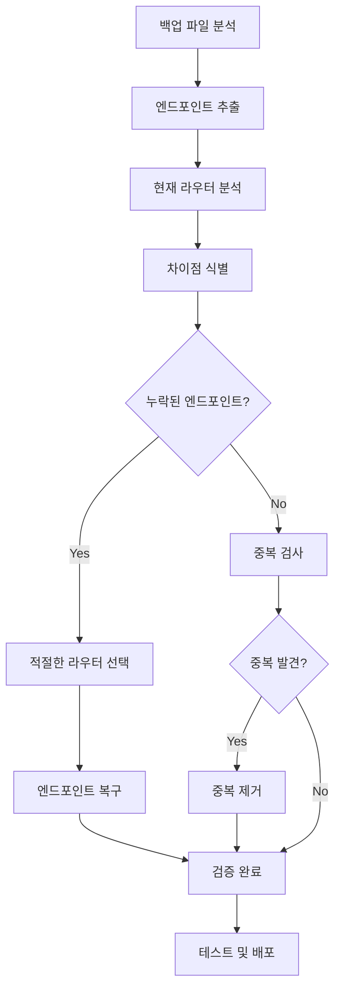
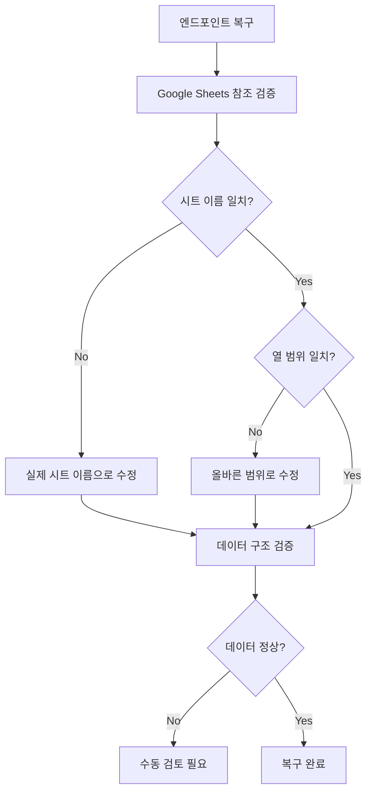

# Design Document: Server Endpoint Recovery

## Overview

서버 라우터 리팩토링 과정에서 발생한 엔드포인트 매핑 오류를 체계적으로 복구하기 위한 설계 문서입니다. 백업 파일(server/index.js.backup.1769270785967)에서 원본 엔드포인트를 추출하고, 현재 34개의 라우터 모듈과 비교하여 누락되거나 잘못 매핑된 엔드포인트를 식별하고 복구합니다.

**핵심 목표:**
- 모든 기존 엔드포인트의 정상 작동 보장
- 체계적이고 유지보수 가능한 라우터 구조 구축
- 중복 제거 및 일관된 URL 패턴 적용
- 성능 최적화 (캐싱, Rate Limiting)

## Architecture

### 전체 구조

```
┌─────────────────────────────────────────────────────────────┐
│                     Express Application                      │
├─────────────────────────────────────────────────────────────┤
│  Middleware Layer                                            │
│  - Timeout Middleware                                        │
│  - CORS Middleware                                           │
│  - JSON Parser                                               │
│  - Logging Middleware                                        │
├─────────────────────────────────────────────────────────────┤
│  Router Modules (34개)                                       │
│  ┌──────────────┬──────────────┬──────────────┐            │
│  │ Health       │ Logging      │ Cache        │            │
│  │ Team         │ Coordinate   │ Store        │            │
│  │ Model        │ Agent        │ MapDisplay   │            │
│  │ Sales        │ Inventory    │ Activation   │            │
│  │ Auth         │ Member       │ Onsale       │            │
│  │ Budget       │ Policy       │ Notification │            │
│  │ Direct       │ Meeting      │ OB           │            │
│  │ SMS          │ Inspection   │ Reservation  │            │
│  │ ...          │ ...          │ ...          │            │
│  └──────────────┴──────────────┴──────────────┘            │
├─────────────────────────────────────────────────────────────┤
│  Shared Context                                              │
│  - sheetsClient (Google Sheets API)                         │
│  - cacheManager (캐싱 시스템)                                │
│  - rateLimiter (Rate Limiting)                              │
│  - discordBot (Discord 알림)                                │
├─────────────────────────────────────────────────────────────┤
│  Error Handling Middleware                                   │
└─────────────────────────────────────────────────────────────┘
```

### 엔드포인트 복구 프로세스




## Components and Interfaces

### 1. Endpoint Analyzer

백업 파일과 현재 라우터 모듈을 분석하여 엔드포인트 목록을 추출하는 컴포넌트입니다.

**책임:**
- 백업 파일에서 모든 HTTP 엔드포인트 추출
- 현재 라우터 모듈에서 등록된 엔드포인트 추출
- 엔드포인트 메타데이터 수집 (메서드, 경로, 미들웨어, 핸들러)

**인터페이스:**
```typescript
interface Endpoint {
  method: 'GET' | 'POST' | 'PUT' | 'DELETE' | 'PATCH';
  path: string;
  handler: string; // 핸들러 함수 시그니처
  middleware: string[]; // 적용된 미들웨어 목록
  module?: string; // 소속 라우터 모듈 (현재 상태)
  category: string; // 기능 카테고리
}

interface AnalysisResult {
  backupEndpoints: Endpoint[];
  currentEndpoints: Endpoint[];
  missing: Endpoint[]; // 백업에는 있지만 현재 없음
  duplicates: Endpoint[]; // 중복된 엔드포인트
  mismatched: Endpoint[]; // 경로는 같지만 구현이 다름
}
```

### 2. Router Mapper

엔드포인트를 적절한 라우터 모듈에 매핑하는 전략을 수립하는 컴포넌트입니다.

**책임:**
- 엔드포인트를 기능별로 그룹화
- 각 엔드포인트에 적절한 라우터 모듈 할당
- 새로운 라우터 모듈 필요 여부 판단
- 베이스 경로 및 URL 패턴 정의

**매핑 전략:**

| 엔드포인트 패턴 | 라우터 모듈 | 베이스 경로 |
|----------------|------------|------------|
| `/health`, `/api/version` | healthRoutes | `/` |
| `/api/client-logs`, `/api/log-activity` | loggingRoutes | `/api` |
| `/api/cache-*` | cacheRoutes | `/api` |
| `/api/teams`, `/api/team-leaders` | teamRoutes | `/api` |
| `/api/update-coordinates`, `/api/update-sales-coordinates` | coordinateRoutes | `/api` |
| `/api/stores` | storeRoutes | `/api` |
| `/api/models` | modelRoutes | `/api` |
| `/api/agents` | agentRoutes | `/api` |
| `/api/map-display-*` | mapDisplayRoutes | `/api` |
| `/api/sales-*` | salesRoutes | `/api` |
| `/api/activation-data/*` | activationRoutes | `/api` |
| `/api/login`, `/api/verify-*` | authRoutes | `/api` |
| `/api/member/*` | memberRoutes | `/api` |
| `/api/onsale/*` | onsaleRoutes | `/api` |
| `/api/inventory*` | inventoryRoutes | `/api` |
| `/api/direct/*` | directStoreAdditionalRoutes | `/api/direct` |
| `/api/test` | miscRoutes | `/api` |


### 3. Endpoint Recovery Module

누락된 엔드포인트를 복구하는 핵심 컴포넌트입니다.

**책임:**
- 백업 파일에서 핸들러 로직 추출
- Shared Context를 사용하도록 코드 변환
- 에러 처리 및 로깅 추가
- 적절한 라우터 모듈에 엔드포인트 추가

**변환 패턴:**

**Before (백업 파일):**
```javascript
app.get('/api/teams', async (req, res) => {
  try {
    const response = await sheets.spreadsheets.values.get({
      spreadsheetId: SPREADSHEET_ID,
      range: '대리점아이디관리!A:R',
    });
    // ... 로직
    res.json(teams);
  } catch (error) {
    console.error('에러:', error);
    res.status(500).json({ error: '조회 실패' });
  }
});
```

**After (라우터 모듈):**
```javascript
router.get('/teams', async (req, res) => {
  try {
    const { sheets, SPREADSHEET_ID } = context.sheetsClient;
    
    // 캐시 확인
    const cacheKey = 'teams_data';
    const cached = context.cacheManager.get(cacheKey);
    if (cached) {
      return res.json(cached);
    }
    
    // Rate Limiting 적용
    const response = await context.rateLimiter.execute(() =>
      sheets.spreadsheets.values.get({
        spreadsheetId: SPREADSHEET_ID,
        range: '대리점아이디관리!A:R',
      })
    );
    
    // ... 로직
    
    // 캐시 저장
    context.cacheManager.set(cacheKey, teams, 300000); // 5분
    
    res.json(teams);
  } catch (error) {
    console.error('❌ [팀목록] 조회 실패:', error);
    
    // Discord 알림 (선택적)
    if (context.discordBot.LOGGING_ENABLED) {
      await context.discordBot.sendNotification(
        context.discordBot.CHANNEL_ID,
        { title: '팀 목록 조회 실패', error: error.message }
      );
    }
    
    res.status(500).json({ 
      error: '팀 목록 조회에 실패했습니다.', 
      details: error.message 
    });
  }
});
```

### 4. Duplicate Resolver

중복된 엔드포인트를 식별하고 해결하는 컴포넌트입니다.

**책임:**
- 동일한 경로와 메서드를 가진 엔드포인트 찾기
- 구현 비교 및 최적 버전 선택
- 중복 제거 및 문서화

**해결 전략:**
1. **완전 동일**: 하나만 유지, 나머지 제거
2. **로직 차이**: 수동 검토 필요 (경고 출력)
3. **버전 차이**: 최신 버전 유지 (타임스탬프 기준)


## Data Models

### Endpoint Inventory (엔드포인트 목록)

백업 파일에서 추출한 주요 엔드포인트 목록:

**Health & Monitoring:**
- `GET /health` - 헬스체크
- `GET /` - 서버 상태 확인
- `GET /api/version` - 서버 버전 정보
- `GET /api/test` - 테스트 API

**Cache Management:**
- `GET /api/cache-status` - 캐시 상태 확인
- `POST /api/cache-refresh` - 캐시 강제 새로고침

**Logging:**
- `POST /api/client-logs` - 클라이언트 로그 수집
- `POST /api/log-activity` - 사용자 활동 로깅

**Team Management:**
- `GET /api/teams` - 팀 목록 조회
- `GET /api/team-leaders` - 팀장 목록 조회

**Coordinate Management:**
- `POST /api/update-coordinates` - 주소를 위도/경도로 변환
- `POST /api/update-sales-coordinates` - 판매점 좌표 업데이트

**Store Management:**
- `GET /api/stores` - 스토어 데이터 조회 (캐싱)

**Map Display Options:**
- `GET /api/map-display-option` - 지도 재고 노출 옵션 조회
- `POST /api/map-display-option` - 지도 재고 노출 옵션 저장
- `POST /api/map-display-option/batch` - 배치 저장 (M 권한자용)
- `GET /api/map-display-option/values` - 선택값 목록 조회
- `GET /api/map-display-option/users` - O 사용자 목록 조회

**Sales Management:**
- `GET /api/sales-data` - 영업 모드 데이터 조회
- `GET /api/sales-mode-access` - 영업 모드 접근 권한 확인

**Inventory Recovery:**
- `GET /api/inventoryRecoveryAccess` - 재고회수모드 접근권한 확인

**Model Management:**
- `GET /api/models` - 모델과 색상 데이터 조회

**Agent Management:**
- `GET /api/agents` - 대리점 ID 정보 조회

**Activation Data:**
- `GET /api/activation-data/current-month` - 당월 개통실적
- `GET /api/activation-data/previous-month` - 전월 개통실적
- `GET /api/activation-data/by-date` - 날짜별 개통실적
- `GET /api/activation-data/date-comparison/:date` - 특정 날짜 당월/전월 비교

**Authentication:**
- `POST /api/login` - 로그인 검증
- `POST /api/verify-password` - 패스워드 검증
- `POST /api/verify-direct-store-password` - 직영점 비밀번호 검증

**Member Management:**
- `POST /api/member/login` - 고객 로그인
- `GET /api/member/queue/all` - 모든 고객 구매 대기 목록
- `GET /api/member/queue` - 고객 구매 대기 목록 조회
- `POST /api/member/queue` - 구매 대기 등록
- `PUT /api/member/queue/:id` - 구매 대기 수정
- `DELETE /api/member/queue/:id` - 구매 대기 삭제
- `GET /api/member/board` - 게시판 목록 조회
- `GET /api/member/board/:id` - 게시판 상세 조회
- `POST /api/member/board` - 게시판 글 작성
- `PUT /api/member/board/:id` - 게시판 글 수정
- `DELETE /api/member/board/:id` - 게시판 글 삭제

**Direct Store Management:**
- `GET /api/direct/drive-monitoring` - Google Drive API 모니터링
- `GET /api/direct/pre-approval-mark/:storeName` - 사전승낙서마크 조회
- `POST /api/direct/pre-approval-mark` - 사전승낙서마크 저장
- `GET /api/direct/store-image/:storeName` - 매장 사진 조회
- `POST /api/direct/store-image` - 매장 사진 정보 저장
- `POST /api/direct/store-image/upload` - 매장 사진 파일 업로드

**Onsale Management:**
- `POST /api/onsale/activation-info/:sheetId/:rowIndex/complete` - 개통완료


### Router Module Mapping

현재 34개 라우터 모듈과 엔드포인트 매핑:

| 라우터 모듈 | 담당 엔드포인트 | 상태 |
|-----------|---------------|------|
| healthRoutes | `/health`, `/`, `/api/version` | ✅ 등록됨 |
| loggingRoutes | `/api/client-logs`, `/api/log-activity` | ⚠️ 부분 등록 |
| cacheRoutes | `/api/cache-status`, `/api/cache-refresh` | ⚠️ 부분 등록 |
| teamRoutes | `/api/teams`, `/api/team-leaders` | ❌ 누락 |
| coordinateRoutes | `/api/update-coordinates`, `/api/update-sales-coordinates` | ❌ 누락 |
| storeRoutes | `/api/stores` | ⚠️ 부분 등록 |
| modelRoutes | `/api/models` | ❌ 누락 |
| agentRoutes | `/api/agents` | ❌ 누락 |
| mapDisplayRoutes | `/api/map-display-*` (5개) | ❌ 누락 |
| salesRoutes | `/api/sales-data`, `/api/sales-mode-access` | ⚠️ 부분 등록 |
| inventoryRecoveryRoutes | `/api/inventoryRecoveryAccess` | ❌ 누락 |
| activationRoutes | `/api/activation-data/*` (4개) | ⚠️ 부분 등록 |
| authRoutes | `/api/login`, `/api/verify-*` (3개) | ⚠️ 부분 등록 |
| memberRoutes | `/api/member/*` (11개) | ⚠️ 부분 등록 |
| onsaleRoutes | `/api/onsale/*` | ❌ 누락 |
| directStoreAdditionalRoutes | `/api/direct/*` (6개) | ⚠️ 부분 등록 |
| miscRoutes | `/api/test` | ❌ 누락 |

**범례:**
- ✅ 등록됨: 모든 엔드포인트가 정상 등록됨
- ⚠️ 부분 등록: 일부 엔드포인트만 등록됨
- ❌ 누락: 엔드포인트가 등록되지 않음


## Correctness Properties

*속성(Property)은 시스템의 모든 유효한 실행에서 참이어야 하는 특성 또는 동작입니다. 속성은 사람이 읽을 수 있는 명세와 기계가 검증할 수 있는 정확성 보장 사이의 다리 역할을 합니다.*

### Property Reflection

중복 제거 분석:
- Property 2.4와 5.1은 동일한 내용 (중복 검출 로직) → 하나로 통합
- Property 3.5와 6.3은 유사한 내용 (베이스 경로 네이밍 규칙) → 하나로 통합
- Property 4.4와 7.1은 동일한 내용 (try-catch 블록) → 하나로 통합
- Property 4.2와 7.4는 유사한 내용 (미들웨어 적용) → 하나로 통합
- Property 8.1과 8.2는 유사한 내용 (캐시 조회) → 하나로 통합
- Property 9.1과 9.2는 유사한 내용 (라우터 등록 순서) → 하나로 통합

최종적으로 중복을 제거하고 각 속성이 고유한 검증 가치를 제공하도록 정리했습니다.

### Property 1: 엔드포인트 추출 완전성

*For any* 백업 파일에서, 모든 HTTP 메서드 패턴(app.get, app.post, app.put, app.delete, app.patch)을 정규표현식으로 검색할 때, 실제 정의된 모든 엔드포인트가 추출 결과에 포함되어야 한다.

**Validates: Requirements 1.1**

### Property 2: 엔드포인트 메타데이터 완전성

*For any* 추출된 엔드포인트에서, 각 엔드포인트는 method, path, handler 필드를 반드시 포함해야 하며, 미들웨어가 있는 경우 middleware 필드도 포함해야 한다.

**Validates: Requirements 1.2, 1.3, 1.5**

### Property 3: 엔드포인트 그룹화 일관성

*For any* 엔드포인트 집합에서, 동일한 URL 프리픽스를 가진 엔드포인트들은 동일한 카테고리로 그룹화되어야 한다.

**Validates: Requirements 1.4**

### Property 4: 라우터 모듈 엔드포인트 추출 완전성

*For any* 라우터 모듈 파일에서, router.get, router.post 등의 패턴으로 정의된 모든 엔드포인트가 추출 결과에 포함되어야 한다.

**Validates: Requirements 2.1**

### Property 5: 베이스 경로 식별 정확성

*For any* 라우터 등록 코드(app.use('/base', router))에서, 베이스 경로가 정확히 추출되어야 하며, 최종 엔드포인트 경로는 베이스 경로와 라우터 경로의 조합이어야 한다.

**Validates: Requirements 2.2**

### Property 6: 엔드포인트 차이 식별 정확성

*For any* 두 엔드포인트 집합(백업, 현재)에서, 차이 비교 결과는 누락(백업에만 존재), 추가(현재에만 존재), 변경(양쪽에 존재하지만 다름)을 정확히 분류해야 한다.

**Validates: Requirements 2.3, 2.5**

### Property 7: 중복 엔드포인트 검출 정확성

*For any* 엔드포인트 집합에서, 동일한 method와 path를 가진 엔드포인트들이 중복으로 식별되어야 한다.

**Validates: Requirements 2.4, 5.1**

### Property 8: RESTful URL 패턴 검증

*For any* URL 경로에서, RESTful 원칙(명사 사용, 복수형, 계층 구조, 동사 미사용)을 위반하는 경우 경고가 발생해야 한다.

**Validates: Requirements 3.4**

### Property 9: 베이스 경로 네이밍 일관성

*For any* 라우터 모듈 집합에서, 모든 베이스 경로는 일관된 네이밍 규칙(소문자, 하이픈 구분, /api 프리픽스)을 따라야 한다.

**Validates: Requirements 3.5, 6.3**

### Property 10: 복구된 엔드포인트 미들웨어 보존

*For any* 복구된 엔드포인트에서, 원본 엔드포인트에 미들웨어가 있었다면 복구된 버전에도 동일한 미들웨어가 적용되어야 한다.

**Validates: Requirements 4.2, 7.4**

### Property 11: Shared Context 사용 검증

*For any* 복구된 엔드포인트 코드에서, Google Sheets API 호출, 캐시 접근, Rate Limiter 사용 시 반드시 context 객체를 통해 접근해야 한다.

**Validates: Requirements 4.3**

### Property 12: 에러 처리 포함 검증

*For any* 복구된 엔드포인트에서, 비동기 작업을 수행하는 경우 반드시 try-catch 블록으로 감싸져 있어야 한다.

**Validates: Requirements 4.4, 7.1**

### Property 13: 엔드포인트 라우터 매핑 정확성

*For any* 복구된 엔드포인트에서, 엔드포인트의 URL 패턴에 따라 정의된 매핑 규칙에 맞는 라우터 모듈에 추가되어야 한다.

**Validates: Requirements 4.5**

### Property 14: 중복 제거 후 유일성 보장

*For any* 중복 제거 후 엔드포인트 집합에서, 동일한 method와 path 조합을 가진 엔드포인트가 하나만 존재해야 한다.

**Validates: Requirements 5.5**

### Property 15: 라우터 등록 순서 규칙 준수

*For any* 라우터 등록 순서에서, 더 구체적인 경로(파라미터 없음)가 덜 구체적인 경로(파라미터 있음, 와일드카드)보다 먼저 등록되어야 한다.

**Validates: Requirements 6.4, 9.1, 9.2**

### Property 16: 베이스 경로 충돌 검사

*For any* 라우터 모듈 집합에서, 의도하지 않은 베이스 경로 충돌(완전히 동일하거나 하나가 다른 것의 프리픽스)이 없어야 한다.

**Validates: Requirements 9.3**

### Property 17: HTTP 상태 코드 적절성

*For any* 에러 응답에서, 에러 타입에 따라 적절한 HTTP 상태 코드(400번대: 클라이언트 오류, 500번대: 서버 오류)가 반환되어야 한다.

**Validates: Requirements 7.2**

### Property 18: 에러 응답 구조 일관성

*For any* 에러 응답에서, 응답 본문은 { error: string, details?: string } 형식을 따라야 한다.

**Validates: Requirements 7.3**

### Property 19: 에러 로깅 수행 검증

*For any* 에러 발생 시, 콘솔 또는 Discord에 에러 정보가 로깅되어야 한다.

**Validates: Requirements 7.5**

### Property 20: 캐시 우선 조회

*For any* Google Sheets API 호출 전에, 동일한 캐시 키로 캐시를 먼저 조회해야 하며, 유효한 캐시가 있으면 API 호출을 건너뛰어야 한다.

**Validates: Requirements 8.1, 8.2**

### Property 21: Rate Limiter 적용 검증

*For any* Google Sheets API 호출에서, rateLimiter.execute() 또는 rateLimitedSheetsCall()을 통해 호출되어야 한다.

**Validates: Requirements 8.3**

### Property 22: Rate Limit 재시도 로직

*For any* Rate Limit 오류(429, RESOURCE_EXHAUSTED) 발생 시, 지수 백오프(exponential backoff)를 사용하여 재시도해야 한다.

**Validates: Requirements 8.4**

### Property 23: 테스트 커버리지 완전성

*For any* 복구된 엔드포인트에서, 성공 케이스와 최소 하나의 실패 케이스(에러 시나리오)에 대한 테스트가 존재해야 한다.

**Validates: Requirements 10.2**

### Property 24: 테스트 실패 로깅 충분성

*For any* 실패한 테스트에서, 로그는 실패한 엔드포인트, 예상 결과, 실제 결과, 에러 메시지를 포함해야 한다.

**Validates: Requirements 10.3**


## Error Handling

### 에러 분류 및 처리 전략

**1. 파일 분석 에러**
- **원인**: 백업 파일 또는 라우터 모듈 파일을 읽을 수 없음
- **처리**: 파일 경로 확인, 권한 확인, 명확한 에러 메시지 출력
- **복구**: 수동으로 파일 경로 수정 또는 권한 부여

**2. 엔드포인트 추출 실패**
- **원인**: 예상하지 못한 코드 패턴, 정규표현식 매칭 실패
- **처리**: 경고 로그 출력, 추출 실패한 패턴 기록
- **복구**: 정규표현식 패턴 개선, 수동 검토

**3. 중복 엔드포인트 충돌**
- **원인**: 동일한 경로와 메서드를 가진 엔드포인트가 여러 개 존재
- **처리**: 
  - 로직이 동일한 경우: 자동으로 하나만 유지
  - 로직이 다른 경우: 경고 출력, 수동 검토 요청
- **복구**: 개발자가 수동으로 올바른 버전 선택

**4. 라우터 등록 실패**
- **원인**: 라우터 모듈 로딩 실패, 문법 오류
- **처리**: 에러 로깅, 해당 라우터 건너뛰기, 서버 계속 실행
- **복구**: 라우터 모듈 코드 수정, 서버 재시작

**5. Google Sheets API 오류**
- **원인**: Rate Limit 초과, 네트워크 오류, 인증 실패
- **처리**: 
  - Rate Limit: 지수 백오프로 재시도 (최대 5회)
  - 네트워크 오류: 재시도 (최대 3회)
  - 인증 실패: 즉시 실패, 환경 변수 확인 요청
- **복구**: 대기 후 자동 재시도 또는 환경 변수 수정

**6. 캐시 오류**
- **원인**: 캐시 데이터 손상, 메모리 부족
- **처리**: 캐시 무효화, 원본 데이터 재조회
- **복구**: 자동 복구 (캐시 재생성)

### 에러 로깅 형식

모든 에러는 다음 형식으로 로깅됩니다:

```javascript
console.error('❌ [카테고리] 에러 설명:', {
  에러타입: error.name,
  에러메시지: error.message,
  스택트레이스: error.stack?.split('\n').slice(0, 5).join('\n'),
  컨텍스트: { /* 추가 정보 */ },
  타임스탬프: new Date().toISOString()
});
```

### Discord 알림 조건

다음 경우에 Discord로 알림을 전송합니다:
- 서버 충돌 (uncaughtException)
- 라우터 등록 실패 (3개 이상)
- Google Sheets API 연속 실패 (5회 이상)
- 중복 엔드포인트 충돌 (로직이 다른 경우)


## Testing Strategy

### 이중 테스트 접근법

엔드포인트 복구의 정확성을 보장하기 위해 단위 테스트와 속성 기반 테스트를 모두 사용합니다.

**단위 테스트 (Unit Tests):**
- 특정 엔드포인트의 복구 결과 검증
- 알려진 백업 파일에서 예상 엔드포인트 추출 확인
- 중복 제거 로직의 구체적인 시나리오 테스트
- 에러 처리 로직의 특정 케이스 검증

**속성 기반 테스트 (Property-Based Tests):**
- 임의의 엔드포인트 집합에 대한 보편적 속성 검증
- 다양한 입력 조합에서 일관된 동작 확인
- 엣지 케이스 자동 발견
- 회귀 방지

### 테스트 구성

**1. 엔드포인트 추출 테스트**

단위 테스트:
```javascript
describe('Endpoint Extraction', () => {
  it('should extract GET endpoint from backup file', () => {
    const code = `app.get('/api/test', (req, res) => { res.json({}); });`;
    const endpoints = extractEndpoints(code);
    expect(endpoints).toHaveLength(1);
    expect(endpoints[0]).toMatchObject({
      method: 'GET',
      path: '/api/test'
    });
  });
  
  it('should extract middleware information', () => {
    const code = `app.post('/api/data', auth, validate, (req, res) => {});`;
    const endpoints = extractEndpoints(code);
    expect(endpoints[0].middleware).toEqual(['auth', 'validate']);
  });
});
```

속성 기반 테스트:
```javascript
describe('Endpoint Extraction Properties', () => {
  it('Property 1: 추출 완전성', () => {
    fc.assert(
      fc.property(
        fc.array(fc.record({
          method: fc.constantFrom('get', 'post', 'put', 'delete', 'patch'),
          path: fc.webPath(),
          handler: fc.string()
        })),
        (endpoints) => {
          const code = generateCode(endpoints);
          const extracted = extractEndpoints(code);
          return extracted.length === endpoints.length;
        }
      ),
      { numRuns: 100 }
    );
  });
});
```

**2. 중복 검출 테스트**

단위 테스트:
```javascript
describe('Duplicate Detection', () => {
  it('should detect exact duplicates', () => {
    const endpoints = [
      { method: 'GET', path: '/api/test', handler: 'handler1' },
      { method: 'GET', path: '/api/test', handler: 'handler1' }
    ];
    const duplicates = findDuplicates(endpoints);
    expect(duplicates).toHaveLength(1);
  });
  
  it('should warn on logic differences', () => {
    const endpoints = [
      { method: 'GET', path: '/api/test', handler: 'handler1' },
      { method: 'GET', path: '/api/test', handler: 'handler2' }
    ];
    const warnings = findDuplicates(endpoints);
    expect(warnings[0].requiresManualReview).toBe(true);
  });
});
```

속성 기반 테스트:
```javascript
describe('Duplicate Detection Properties', () => {
  it('Property 7: 중복 검출 정확성', () => {
    fc.assert(
      fc.property(
        fc.array(fc.record({
          method: fc.constantFrom('GET', 'POST', 'PUT', 'DELETE'),
          path: fc.webPath()
        })),
        (endpoints) => {
          const duplicates = findDuplicates(endpoints);
          // 모든 중복은 동일한 method와 path를 가져야 함
          return duplicates.every(dup => 
            dup.items.every(item => 
              item.method === dup.items[0].method &&
              item.path === dup.items[0].path
            )
          );
        }
      ),
      { numRuns: 100 }
    );
  });
});
```

**3. 엔드포인트 복구 테스트**

단위 테스트:
```javascript
describe('Endpoint Recovery', () => {
  it('should convert to use Shared Context', () => {
    const original = `
      const response = await sheets.spreadsheets.values.get({
        spreadsheetId: SPREADSHEET_ID,
        range: 'Sheet1!A:Z'
      });
    `;
    const recovered = recoverEndpoint(original, context);
    expect(recovered).toContain('context.sheetsClient.sheets');
    expect(recovered).toContain('context.sheetsClient.SPREADSHEET_ID');
  });
  
  it('should add error handling', () => {
    const original = `res.json(data);`;
    const recovered = recoverEndpoint(original, context);
    expect(recovered).toContain('try {');
    expect(recovered).toContain('catch (error)');
  });
});
```

속성 기반 테스트:
```javascript
describe('Endpoint Recovery Properties', () => {
  it('Property 12: 에러 처리 포함', () => {
    fc.assert(
      fc.property(
        fc.string(), // 임의의 핸들러 코드
        (handlerCode) => {
          if (handlerCode.includes('async')) {
            const recovered = recoverEndpoint(handlerCode, context);
            return recovered.includes('try') && recovered.includes('catch');
          }
          return true;
        }
      ),
      { numRuns: 100 }
    );
  });
});
```

**4. 통합 테스트**

복구된 엔드포인트가 실제로 작동하는지 확인:

```javascript
describe('Endpoint Integration Tests', () => {
  let app;
  
  beforeAll(() => {
    app = createTestApp(); // 복구된 라우터로 앱 생성
  });
  
  it('GET /api/teams should return team list', async () => {
    const response = await request(app).get('/api/teams');
    expect(response.status).toBe(200);
    expect(Array.isArray(response.body)).toBe(true);
  });
  
  it('GET /api/stores should use cache', async () => {
    const spy = jest.spyOn(context.sheetsClient.sheets.spreadsheets.values, 'get');
    
    // 첫 번째 호출
    await request(app).get('/api/stores');
    expect(spy).toHaveBeenCalledTimes(1);
    
    // 두 번째 호출 (캐시 사용)
    await request(app).get('/api/stores');
    expect(spy).toHaveBeenCalledTimes(1); // 여전히 1회
  });
  
  it('should handle errors gracefully', async () => {
    // Google Sheets API 오류 시뮬레이션
    jest.spyOn(context.sheetsClient.sheets.spreadsheets.values, 'get')
      .mockRejectedValue(new Error('API Error'));
    
    const response = await request(app).get('/api/teams');
    expect(response.status).toBe(500);
    expect(response.body).toHaveProperty('error');
  });
});
```

### 속성 기반 테스트 설정

**라이브러리**: fast-check (JavaScript/TypeScript용 PBT 라이브러리)

**설정**:
```javascript
// jest.config.js
module.exports = {
  testEnvironment: 'node',
  testMatch: ['**/__tests__/**/*.test.js'],
  collectCoverageFrom: [
    'server/routes/**/*.js',
    'server/utils/**/*.js'
  ],
  coverageThreshold: {
    global: {
      branches: 80,
      functions: 80,
      lines: 80,
      statements: 80
    }
  }
};
```

**각 속성 테스트는 최소 100회 반복 실행**:
```javascript
fc.assert(fc.property(...), { numRuns: 100 });
```

**태그 형식**:
```javascript
/**
 * Feature: server-endpoint-recovery
 * Property 1: 엔드포인트 추출 완전성
 * 
 * For any 백업 파일에서, 모든 HTTP 메서드 패턴을 검색할 때,
 * 실제 정의된 모든 엔드포인트가 추출 결과에 포함되어야 한다.
 */
it('Property 1: 엔드포인트 추출 완전성', () => { ... });
```

### 테스트 실행 및 검증

**개발 중**:
```bash
npm test -- --watch
```

**CI/CD 파이프라인**:
```bash
npm test -- --coverage --ci
```

**복구 후 검증**:
```bash
# 1. 단위 테스트 실행
npm test

# 2. 통합 테스트 실행
npm run test:integration

# 3. 서버 시작 및 수동 검증
npm start

# 4. 주요 엔드포인트 수동 테스트
curl http://localhost:4000/health
curl http://localhost:4000/api/teams
curl http://localhost:4000/api/stores
```

### 수동 검증 체크리스트

복구 완료 후 다음 항목을 수동으로 확인:

- [ ] 서버가 정상적으로 시작됨
- [ ] 모든 라우터 모듈이 에러 없이 등록됨
- [ ] 헬스체크 엔드포인트 응답 확인
- [ ] 주요 엔드포인트 (teams, stores, agents) 정상 작동
- [ ] 캐싱이 올바르게 작동함 (두 번째 요청이 빠름)
- [ ] 에러 발생 시 적절한 상태 코드 반환
- [ ] Discord 로깅이 작동함 (설정된 경우)
- [ ] 프론트엔드 애플리케이션이 정상 작동함
- [ ] 모든 모드(재고, 영업, 직영점 등)가 정상 작동함
- [ ] 성능 저하가 없음 (응답 시간 비교)


## Additional Issues Identified

사용자 피드백을 통해 추가로 발견된 문제들:

### 1. 앱 업데이트 데이터 문제
**증상**: 앱 업데이트 정보가 제대로 표시되지 않음
**원인**: 잘못된 Google Sheets 범위에서 데이터를 가져옴
**영향**: 사용자가 최신 앱 버전 정보를 확인할 수 없음
**해결 방안**: 
- 올바른 시트 이름과 범위 확인
- appUpdateRoutes.js에서 시트 참조 수정
- 데이터 구조 검증

### 2. 정책모드 추가정책 문제
**증상**: 
- 담당자 정보가 정확하지 않음
- 정책 목록이 표시되지 않음
**원인**: 
- 잘못된 시트 이름 사용
- 잘못된 범위 지정
- 실제 Google Sheets 구조와 코드의 불일치
**영향**: 정책 관리 기능 전체가 작동하지 않음
**해결 방안**:
- 실제 Google Sheets의 시트 이름 확인
- 올바른 열 범위 매핑
- policyRoutes.js 및 policyNoticeRoutes.js 수정

### 3. Google Sheets 참조 불일치
**일반적인 문제 패턴**:
- 코드에서 사용하는 시트 이름이 실제 시트 이름과 다름
- 열 범위가 실제 데이터 구조와 맞지 않음
- 하드코딩된 시트 이름이 변경되지 않음

**체계적 해결 방안**:
1. 모든 Google Sheets 참조를 추출하여 목록화
2. 실제 Google Sheets 구조와 비교
3. 불일치하는 참조를 모두 수정
4. 시트 이름을 환경 변수 또는 설정 파일로 관리

### 복구 프로세스 개선

기존 복구 프로세스에 다음 단계 추가:



### Google Sheets 참조 검증 체크리스트

복구 시 다음 항목을 반드시 확인:

**앱 업데이트 관련**:
- [ ] 시트 이름: 실제 시트 이름 확인
- [ ] 범위: 버전, 업데이트 내용, 날짜 등 필수 필드 포함
- [ ] 데이터 형식: 버전 번호 형식 검증

**정책 관련**:
- [ ] 시트 이름: '정책공지' 또는 실제 시트 이름 확인
- [ ] 담당자 열: 올바른 열 인덱스 확인
- [ ] 정책 내용 열: 제목, 내용, 날짜 등 필드 확인
- [ ] 필터링 로직: 담당자별 정책 필터링 검증

**공통 확인 사항**:
- [ ] 시트 이름이 하드코딩되지 않고 설정에서 관리됨
- [ ] 열 인덱스가 주석으로 명확히 표시됨
- [ ] 데이터 파싱 로직이 실제 데이터 형식과 일치
- [ ] 에러 처리가 시트 없음/범위 오류를 처리함

